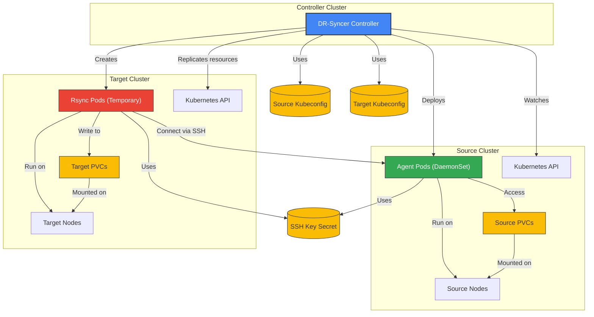
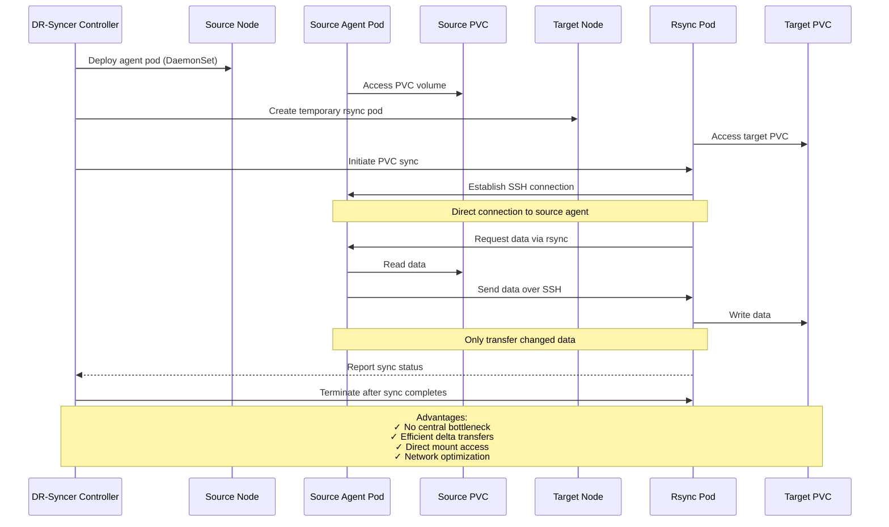

# Architecture & Principles

This document explains the core concepts behind DR-Syncer's design and how it works to provide Kubernetes resource and data replication between clusters.

## Overview

DR-Syncer provides Kubernetes resource and data replication between clusters using a controller-based architecture with agent components for data synchronization.

## Controller Architecture

DR-Syncer uses a controller-based architecture with the following components:

1. **Central Controller**: Runs in its own cluster and manages all resource synchronization operations
2. **Agent Pods**: Run only on the source cluster nodes where PVCs are mounted
3. **Rsync Pods**: Created temporarily in the target cluster to facilitate data transfer

## Resource Synchronization Mechanism

Resource synchronization between clusters works as follows:

1. The controller watches for resources in the source cluster based on your NamespaceMapping configuration
2. When changes are detected (or on schedule/manual trigger), the controller:
   - Fetches the resource definition from the source cluster
   - Applies necessary transformations (storage class mapping, namespace changes, etc.)
   - Handles special resources like PVCs, Services, and Ingresses with custom logic
   - Applies the transformed resource to the target cluster

The controller uses the Kubernetes API directly to perform these operations, ensuring consistent and reliable replication with proper error handling and retries.

## PVC Data Synchronization

DR-Syncer's unique approach to persistent volume data synchronization works as follows:

1. **Agent Deployment**: The controller deploys agent pods as a DaemonSet on the source cluster only
2. **Rsync Pod Creation**: When synchronization is required, temporary rsync pods are created in the target cluster
3. **Direct Connection**: Rsync pods establish SSH connections to the agent pods on the source cluster
4. **Rsync Over SSH**: Data is transferred using rsync over the SSH connection, providing efficient and secure data transfer

The advantages of this approach include:

- **Eliminates Central Bottlenecks**: Data flows directly between source and target clusters
- **Bandwidth Efficiency**: Only changed data is transferred using rsync's delta algorithm
- **Mount Point Access**: Agents run with appropriate privileges to access volume mount points directly
- **Network Efficiency**: Traffic follows the most direct path between clusters

## Synchronization Modes

DR-Syncer supports three primary modes of operation:

1. **Manual Mode**: Synchronization triggered by explicit user action
2. **Scheduled Mode**: Synchronization runs on a configurable schedule (cron expression)
3. **Continuous Mode**: Real-time synchronization with immediate change detection

In continuous mode, the controller watches resources in the source cluster and immediately replicates changes to the target cluster, providing near-real-time disaster recovery capabilities.

## Security Considerations

DR-Syncer includes several security features:

- **Isolated Agent Permissions**: Agents have only the permissions necessary for their operation
- **SSH for Secure Transfer**: All data transfer uses SSH encryption
- **Node-specific Operations**: Agents only operate on PVCs mounted on their node
- **Credential Isolation**: Cluster credentials are stored as Kubernetes secrets with appropriate RBAC

This design provides a balance of security and performance for disaster recovery operations.
