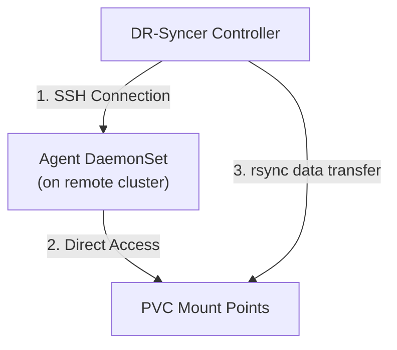

# Features

DR-Syncer provides a comprehensive set of features designed to streamline the disaster recovery process for Kubernetes clusters. This page details each feature and explains how they work together to create a reliable disaster recovery solution.

## Resource Synchronization

The core functionality of DR-Syncer is its ability to synchronize resources between Kubernetes clusters, ensuring your DR environment accurately reflects your production environment.

### Supported Resource Types

DR-Syncer can synchronize various Kubernetes resource types between clusters, including:

| Resource Type | Synchronization Details |
|---------------|-------------------------|
| ConfigMaps | Configuration data with exact content matching |
| Secrets | Encrypted data with secure handling |
| Deployments | Application deployments with scale control |
| StatefulSets | Stateful applications with ordered pod management |
| DaemonSets | Node-level services synchronized to destination cluster |
| Services | Network services with appropriate transformation |
| Ingresses | External access rules with annotation handling |
| PersistentVolumeClaims | Storage claims with optional data replication |
| Custom Resources | Extended Kubernetes resources with schema preservation |

Resource synchronization is implemented through the Kubernetes API, ensuring all resources are managed through native mechanisms.


### Filtering Capabilities

DR-Syncer provides granular control over which resources are synchronized:

- **Resource Type Filtering**: Specify exactly which resource types to synchronize in the Replication CRD:
  ```yaml
  resourceTypes:
    - ConfigMap
    - Secret
    - Deployment
    - Service
  ```

- **Label-based Filtering**: Include or exclude resources based on labels. Resources with the `dr-syncer.io/ignore: "true"` label are automatically excluded from synchronization.
  ```yaml
  excludeLabels:
    - key: dr-syncer.io/ignore
      value: "true"
    - key: environment
      value: "dev-only"
  ```

- **Namespace Selection**: Synchronize resources between specific namespaces:
  ```yaml
  sourceNamespace: production
  destinationNamespace: production-dr
  ```

- **Resource Exclusion**: Explicitly exclude specific resources from synchronization:
  ```yaml
  excludeResources:
    - name: sensitive-secret
      kind: Secret
    - name: local-only-config
      kind: ConfigMap
  ```

### Metadata Handling

DR-Syncer carefully manages resource metadata during synchronization:

- **Metadata Preservation**: Maintains important metadata like labels and annotations
- **Resource Versioning**: Handles resource versions to prevent conflicts and API server rejections
- **Ownership References**: Updates owner references when synchronizing dependent resources
- **Immutable Fields**: Special handling for immutable fields that cannot be changed after creation
- **Status Synchronization**: Preserves or updates status fields according to configuration

Example of metadata handling in synchronization:
```go
// Simplified example of metadata handling
func syncResource(source, destination *unstructured.Unstructured) {
    // Preserve existing immutable fields
    if value, exists := destination.GetAnnotations()["immutable-fields"]; exists {
        immutableFields := strings.Split(value, ",")
        for _, field := range immutableFields {
            // Preserve the immutable field from destination
            fieldValue, found, _ := unstructured.NestedFieldCopy(destination.Object, strings.Split(field, ".")...)
            if found {
                unstructured.SetNestedField(source.Object, fieldValue, strings.Split(field, ".")...)
            }
        }
    }
    
    // Add synchronization annotations
    annotations := source.GetAnnotations()
    if annotations == nil {
        annotations = make(map[string]string)
    }
    annotations["dr-syncer.io/last-synced"] = time.Now().Format(time.RFC3339)
    annotations["dr-syncer.io/source-cluster"] = controllerClusterName
    source.SetAnnotations(annotations)
}
```

## Synchronization Modes

DR-Syncer supports multiple synchronization modes to fit diverse disaster recovery requirements and operational preferences.

### Continuous Mode

Continuous mode provides real-time synchronization of resources between clusters:

- **How it works**: The controller watches for changes to resources in the source namespace and immediately synchronizes those changes to the destination cluster
- **Benefits**: Minimal recovery point objective (RPO), ensuring the DR environment is always current
- **Implementation**: Uses Kubernetes watch API to detect changes and triggers immediate reconciliation
- **Resource efficiency**: Implements smart detection to avoid unnecessary synchronizations
- **Change detection**: Identifies meaningful changes that require synchronization versus metadata updates that can be ignored

Configure continuous mode in the Replication resource:
```yaml
spec:
  sync:
    mode: Continuous
```

### Scheduled Mode

Scheduled mode enables periodic synchronization on a defined schedule:

- **Cron-based scheduling**: Uses standard cron expressions for flexible scheduling
- **Schedule examples**:
  - Every 6 hours: `0 */6 * * *`
  - Daily at midnight: `0 0 * * *`
  - Every Monday at 2am: `0 2 * * 1`
- **Bandwidth efficiency**: Ideal for environments where continuous synchronization would consume excessive bandwidth
- **Controlled updates**: Predictable synchronization windows for monitoring and validation
- **Implementation**: Uses controller-based cron parsing and execution with jitter to prevent thundering herd problems

Configure scheduled mode with a cron expression:
```yaml
spec:
  sync:
    mode: Scheduled
    schedule: "0 */6 * * *"  # Every 6 hours
```

### Manual Mode

Manual mode provides on-demand synchronization triggered by administrators:

- **Use cases**: 
  - DR testing scenarios
  - Pre-maintenance synchronization
  - Controlled updates during maintenance windows
- **Annotation-triggered**: Add or update the `dr-syncer.io/sync-now: "true"` annotation to trigger synchronization
- **Status tracking**: Detailed status reporting for manual synchronization operations
- **Implementation**: Watch for annotation changes on the Replication resource

Configure manual mode:
```yaml
spec:
  sync:
    mode: Manual
```

Trigger a manual synchronization:
```bash
kubectl annotate replication production-to-dr dr-syncer.io/sync-now="true" --overwrite
```

### Mode Comparison

| Feature | Continuous | Scheduled | Manual |
|---------|------------|-----------|--------|
| Recovery Point Objective | Lowest (near real-time) | Depends on schedule | Highest (manual only) |
| Network bandwidth usage | Highest | Moderate | Lowest |
| Operational control | Automated | Predictable | Full control |
| Best for | Critical systems | Standard DR | Testing & maintenance |
| Resource usage | Higher | Moderate | Lowest |

## Deployment Management

DR-Syncer intelligently handles deployment resources with DR-specific optimizations that balance recovery readiness with resource efficiency.

### Scale Control

The default behavior scales down deployments to zero replicas in DR clusters, while preserving the ability to quickly scale up when needed:

- **Zero-Replica Default**: By default, deployments are synchronized with zero replicas in DR clusters to conserve resources:
  ```go
  // Simplified version of replica handling logic
  if isDeployment(resource) && config.ScaleToZero {
      // Store original replica count in annotation
      originalReplicas, _, _ := unstructured.NestedInt64(resource.Object, "spec", "replicas")
      annotations := resource.GetAnnotations()
      if annotations == nil {
          annotations = make(map[string]string)
      }
      annotations["dr-syncer.io/original-replicas"] = strconv.FormatInt(originalReplicas, 10)
      resource.SetAnnotations(annotations)
      
      // Set replicas to zero
      unstructured.SetNestedField(resource.Object, int64(0), "spec", "replicas")
  }
  ```

- **Scale Override via Labels**: Keep specific deployments at their original scale using the `dr-syncer.io/scale-override: "true"` label:
  ```yaml
  apiVersion: apps/v1
  kind: Deployment
  metadata:
    name: critical-service
    labels:
      dr-syncer.io/scale-override: "true"  # This deployment will keep its original replica count
  spec:
    replicas: 3
    # ... rest of deployment spec
  ```

- **Original Scale Preservation**: Annotations store the original replica count for quick recovery:
  ```yaml
  apiVersion: apps/v1
  kind: Deployment
  metadata:
    name: app-deployment
    annotations:
      dr-syncer.io/original-replicas: "3"  # Original replica count preserved here
  spec:
    replicas: 0  # Scaled to zero in DR
    # ... rest of deployment spec
  ```

- **DR Activation**: During DR activation, quickly restore replica counts with a simple command:
  ```bash
  kubectl get deployments -n production-dr -o json | \
    jq '.items[] | select(.metadata.annotations."dr-syncer.io/original-replicas" != null) | 
    .metadata.name + " " + .metadata.annotations."dr-syncer.io/original-replicas"' | \
    xargs -n 2 sh -c 'kubectl scale deployment $0 --replicas=$1 -n production-dr'
  ```

### Resource Configuration

DR-Syncer preserves all deployment configuration while applying DR-specific transformations:

- **Resource Requests/Limits**: By default, preserves resource specifications exactly:
  ```yaml
  resources:
    limits:
      cpu: "1"
      memory: "1Gi"
    requests:
      cpu: "200m"
      memory: "256Mi"
  ```

- **Environment Variables**: Maintains environment variables for identical application behavior:
  ```yaml
  env:
    - name: DATABASE_URL
      valueFrom:
        secretKeyRef:
          name: db-credentials
          key: url
  ```

- **Volume Mounts**: Preserves volume configurations with appropriate storage class mapping:
  ```yaml
  volumeMounts:
    - name: data-volume
      mountPath: /data
  volumes:
    - name: data-volume
      persistentVolumeClaim:
        claimName: app-data  # This reference is automatically updated if needed
  ```

- **Configuration Transformation**: Supports custom transformations via annotations for environment-specific changes:
  ```yaml
  metadata:
    annotations:
      dr-syncer.io/transform-env: "PRODUCTION_URL:DR_URL,PROD_MODE:DR_MODE"
  ```

## PVC Synchronization

DR-Syncer's PVC synchronization capabilities extend beyond simple resource replication to include the actual data stored in persistent volumes, addressing a critical gap in traditional Kubernetes DR solutions.

### Data Replication Architecture

Data replication is implemented using a secure agent architecture:



The data replication process follows these steps:

1. **Discovery**: Identify PVCs to synchronize based on Replication configuration
2. **PVC Creation**: Ensure destination PVCs exist with correct configuration
3. **Connection**: Establish secure SSH connection to agent in destination cluster
4. **Rsync Transfer**: Use rsync over SSH to efficiently transfer data
5. **Verification**: Validate successful data transfer

### Data Replication Features

- **Secure SSH-based rsync**: Industry-standard secure data transfer mechanism:
  ```
  rsync -avz --delete -e "ssh -p 2222 -i /path/to/key -o StrictHostKeyChecking=no" /source/path/ user@agent-host:/destination/path/
  ```

- **Incremental Synchronization**: Only transfers changed data blocks to minimize bandwidth usage and time:
  ```
  # rsync calculates differences with checksums and timestamps
  # Example of small incremental transfer details:
  #
  # sent 1,854 bytes  received 898 bytes  1,836.00 bytes/sec
  # total size is 5,242,880  speedup is 1,902.13
  ```

- **Bandwidth Control**: Rate limiting options to prevent network saturation
  ```
  # Configure rate limiting with --bwlimit option
  rsync --bwlimit=10000  # Limit to 10MB/sec
  ```

- **Automatic Retry**: Built-in exponential backoff retry mechanism:
  ```go
  // Simplified retry logic
  backoff := wait.Backoff{
      Duration: 5 * time.Second,
      Factor:   2.0,
      Jitter:   0.1,
      Steps:    5,
  }
  
  err := retry.OnError(backoff, func() error {
      return syncPVCData(source, destination)
  })
  ```

### Storage Management

DR-Syncer provides sophisticated storage management capabilities:

- **Storage Class Mapping**: Maps between different storage classes in different environments:
  ```yaml
  pvcConfig:
    storageClassMapping:
      fast-ssd: standard-dr
      local-storage: remote-storage
  ```

- **Access Mode Handling**: Converts between different access modes based on target cluster capabilities:
  ```yaml
  pvcConfig:
    accessModeMapping:
      ReadWriteOnce: ReadWriteMany  # Convert RWO volumes to RWM in DR
  ```

- **Volume Size Management**: Ensures destination volumes have sufficient capacity:
  ```yaml
  # Source PVC
  spec:
    resources:
      requests:
        storage: 10Gi
  
  # Destination PVC automatically created with same or mapped size
  ```

- **Dynamic Provisioning**: Works with dynamically provisioned volumes using appropriate storage classes:
  ```yaml
  # The controller automatically requests appropriate storage class provisioning
  ```

### Security Features

DR-Syncer implements robust security for PVC data replication:

- **SSH Key Management**:
  - Secure key generation with proper permissions
  - Keys stored as Kubernetes secrets with appropriate RBAC
  - Regular key rotation capabilities
  - Fingerprint tracking for key verification

- **Agent Security Model**:
  - Agent runs with minimal privileges (non-root)
  - Direct access to mounted PVCs without requiring root access
  - SSH configuration restricts allowed commands
  - Comprehensive logging and audit trail

- **Command Restriction**:
  ```
  # In authorized_keys file
  command="rsync --server -vlogDtprze.iLsfxC . /path",no-port-forwarding,no-X11-forwarding,no-agent-forwarding,no-pty ssh-rsa AAAA...
  ```

- **Secure Communication**:
  - TLS encryption for all communication
  - SSH tunneling for data transfer
  - Strict host key checking options

## Service & Ingress Handling

DR-Syncer intelligently handles network-related resources (Services and Ingresses) which often require special treatment when moving between clusters.

### Service Adaptation

Service resources are transformed appropriately for the destination environment:

- **ClusterIP Handling**: By default, ClusterIP is not preserved (allowing the target cluster to assign a new one):
  ```go
  // Simplified service ClusterIP handling
  if isService(resource) && !config.PreserveClusterIP {
      unstructured.RemoveNestedField(resource.Object, "spec", "clusterIP")
  }
  ```

- **Service Type Preservation**: Maintains the service type (ClusterIP, NodePort, LoadBalancer, ExternalName):
  ```yaml
  spec:
    type: LoadBalancer  # Preserved during synchronization
  ```

- **NodePort Handling**: Options to preserve or allow reassignment of NodePort values:
  ```yaml
  # Original NodePort service
  spec:
    type: NodePort
    ports:
    - port: 80
      targetPort: 8080
      nodePort: 30080
  
  # NodePort handling options
  serviceConfig:
    preserveNodePorts: true  # Keep exact nodePort values
  ```

- **Headless Service Support**: Properly handles headless services (services with clusterIP: None):
  ```yaml
  # Headless service correctly synchronized
  spec:
    clusterIP: None
    selector:
      app: stateful-app
  ```

- **Selector Handling**: Ensures selectors match the pods in the destination cluster:
  ```yaml
  spec:
    selector:
      app: myapp
      environment: production  # Automatically adjusted if needed
  ```

### Ingress Configuration

Ingress resources receive special handling due to their environment-specific nature:

- **Annotation Management**: Flexible control over which annotations to preserve:
  ```yaml
  ingressConfig:
    preserveAnnotations: true  # Preserve all annotations
    
    # OR specify specific annotations
    preserveAnnotationsList:
      - kubernetes.io/ingress.class
      - nginx.ingress.kubernetes.io/rewrite-target
  ```

- **TLS Certificate Handling**: Options to preserve or adapt TLS certificate references:
  ```yaml
  ingressConfig:
    preserveTLS: true  # Keep TLS certificate references
  
  # TLS configuration preserved
  spec:
    tls:
    - hosts:
      - myapp.example.com
      secretName: myapp-tls-cert
  ```

- **Backend Service Adaptation**: Automatically updates backend service references:
  ```yaml
  # Original backend reference
  spec:
    rules:
    - http:
        paths:
        - path: /api
          backend:
            serviceName: api-service
            servicePort: 80
  
  # If api-service is in a different namespace in DR, the reference is updated
  ```

- **Host Configuration**: Options to preserve or transform host configurations:
  ```yaml
  ingressConfig:
    transformHosts: true  # Enable host transformation
    hostSuffix: "-dr.example.com"  # Append suffix to hosts
  
  # Original: myapp.example.com
  # Transformed: myapp-dr.example.com
  ```

- **Path Handling**: Preserves path configurations for proper routing:
  ```yaml
  spec:
    rules:
    - http:
        paths:
        - path: /api
          pathType: Prefix
  ```

## Operational Features

DR-Syncer includes a comprehensive set of operational features designed to provide reliability, visibility, and manageability in production environments.

### High Availability

DR-Syncer is designed for high availability in mission-critical environments:

- **Leader Election**: Implements Kubernetes leader election to ensure only one controller instance is active:
  ```go
  mgr, err := ctrl.NewManager(ctrl.GetConfigOrDie(), ctrl.Options{
      Scheme:             scheme,
      LeaderElection:     true,
      LeaderElectionID:   "dr-syncer-leader-election",
  })
  ```

- **Controller Failover**: Automatic failover to standby controller instances if the leader fails:
  ```
  I0308 152430.123456       1 leaderelection.go:278] successfully acquired lease dr-syncer-system/dr-syncer-leader-election
  ```

- **Resource Locking**: Uses Kubernetes resource locks to prevent multiple controllers from making conflicting changes:
  ```go
  // Resource lock configuration
  mgr, err := ctrl.NewManager(ctrl.GetConfigOrDie(), ctrl.Options{
      Scheme:             scheme,
      LeaderElection:     true,
      LeaderElectionID:   "dr-syncer-leader-election",
      LeaderElectionResourceLock: "leases",
  })
  ```

- **Graceful Shutdown**: Proper shutdown handling to prevent orphaned operations:
  ```go
  // Signal handler for graceful shutdown
  ctx := ctrl.SetupSignalHandler()
  if err := mgr.Start(ctx); err != nil {
      setupLog.Error(err, "problem running manager")
      os.Exit(1)
  }
  ```

### Monitoring & Status

Comprehensive status reporting and monitoring capabilities:

- **Phase Tracking**: Clear phase reporting for each synchronization operation:
  ```yaml
  status:
    phase: Running  # Pending, Running, Completed, Failed
  ```

- **Detailed Status Conditions**: Condition-based status reporting for complex state representation:
  ```yaml
  status:
    conditions:
      - type: Syncing
        status: "True"
        lastTransitionTime: "2025-03-08T15:30:00Z"
        reason: ScheduledSync
        message: "Synchronization in progress"
  ```

- **Resource-Specific Status**: Granular reporting on synchronization status per resource type:
  ```yaml
  status:
    resourceStatus:
      - kind: Deployment
        synced: 10
        failed: 0
      - kind: ConfigMap
        synced: 15
        failed: 0
  ```

- **Prometheus Metrics**: Comprehensive metrics for monitoring and alerting:
  ```go
  // Metric registration examples
  var (
      syncOperationsTotal = prometheus.NewCounterVec(
          prometheus.CounterOpts{
              Name: "dr_syncer_sync_operations_total",
              Help: "Total number of synchronization operations",
          },
          []string{"namespace", "status"},
      )
      resourcesSyncedTotal = prometheus.NewCounterVec(
          prometheus.CounterOpts{
              Name: "dr_syncer_resources_synced_total",
              Help: "Total number of resources synchronized",
          },
          []string{"namespace", "resource_type", "status"},
      )
  )
  ```

- **Health Endpoints**: Standard health check endpoints for integration with monitoring tools:
  ```go
  mgr, err := ctrl.NewManager(ctrl.GetConfigOrDie(), ctrl.Options{
      HealthProbeBindAddress: "0.0.0.0:8081",
  })
  ```

### Error Handling

Robust error handling mechanisms ensure reliability and recoverability:

- **Exponential Backoff**: Intelligent retry logic with exponential backoff and jitter:
  ```go
  backoff := wait.Backoff{
      Duration: time.Second,
      Factor:   2.0,
      Jitter:   0.1,
      Steps:    5,
      Cap:      time.Minute,
  }
  
  err := retry.OnError(backoff, func() error {
      return executeOperation()
  })
  ```

- **Graceful Recovery**: Failure recovery without disrupting synchronization:
  ```go
  // Simplified error handling in reconcile loop
  if err := syncResource(resource); err != nil {
      // Record error in status
      replication.Status.ResourceErrors++
      
      // Record event
      recorder.Event(replication, corev1.EventTypeWarning, "SyncFailed", 
          fmt.Sprintf("Failed to sync %s/%s: %v", resource.GetKind(), resource.GetName(), err))
      
      // Continue with next resource rather than failing entire sync
      continue
  }
  ```

- **Detailed Error Reporting**: Comprehensive error details in status and events:
  ```yaml
  status:
    lastError: "Failed to sync Deployment/api-service: timeout connecting to API server"
    lastErrorTime: "2025-03-08T15:35:00Z"
  ```

- **Event Recording**: Kubernetes events for synchronization status and errors:
  ```go
  recorder.Event(replication, corev1.EventTypeNormal, "SyncCompleted", 
      fmt.Sprintf("Successfully synchronized %d resources", syncCount))
  ```

## Cluster Management

DR-Syncer provides comprehensive multi-cluster management capabilities to support complex disaster recovery topologies.

### Multi-cluster Support

Support for multiple remote clusters with independent configuration:

- **Multiple DR Environments**: Configure synchronization to multiple DR clusters:
  ```yaml
  # RemoteCluster 1
  apiVersion: dr-syncer.io/v1alpha1
  kind: RemoteCluster
  metadata:
    name: dr-cluster-east
  spec:
    kubeconfigSecret: dr-cluster-east-kubeconfig
  ---
  # RemoteCluster 2
  apiVersion: dr-syncer.io/v1alpha1
  kind: RemoteCluster
  metadata:
    name: dr-cluster-west
  spec:
    kubeconfigSecret: dr-cluster-west-kubeconfig
  ```

- **Per-Cluster Configuration**: Each remote cluster can have its own configuration:
  ```yaml
  # Replication to East cluster
  apiVersion: dr-syncer.io/v1alpha1
  kind: Replication
  metadata:
    name: production-to-east
  spec:
    sourceNamespace: production
    destinationNamespace: production-dr
    destinationCluster: dr-cluster-east
    resourceTypes:
      - ConfigMap
      - Secret
      - Deployment
  ---
  # Replication to West cluster with different configuration
  apiVersion: dr-syncer.io/v1alpha1
  kind: Replication
  metadata:
    name: production-to-west
  spec:
    sourceNamespace: production
    destinationNamespace: production-dr
    destinationCluster: dr-cluster-west
    resourceTypes:
      - ConfigMap
      - Secret
      - Deployment
      - Service
      - PersistentVolumeClaim
    pvcConfig:
      includeData: true
  ```

- **Cluster Health Monitoring**: Continuous monitoring of cluster availability:
  ```yaml
  status:
    connectionStatus: Connected  # Connected, Disconnected, Pending
    lastConnectionTime: "2025-03-08T15:30:00Z"
    connections: 120  # Successful connections since controller started
    connectionErrors: 2  # Connection errors since controller started
  ```

- **Connectivity Validation**: Regular validation of cluster connectivity:
  ```go
  // Regular connectivity check
  func (r *RemoteClusterReconciler) validateConnection(ctx context.Context, cluster *drv1alpha1.RemoteCluster) error {
      // Create test client
      config, err := clientcmd.RESTConfigFromKubeConfig(cluster.Spec.KubeconfigData)
      if err != nil {
          return fmt.Errorf("error creating REST config: %v", err)
      }
      
      // Test API server connection
      client, err := kubernetes.NewForConfig(config)
      if err != nil {
          return fmt.Errorf("error creating Kubernetes client: %v", err)
      }
      
      // Check API server version
      version, err := client.Discovery().ServerVersion()
      if err != nil {
          return fmt.Errorf("error connecting to API server: %v", err)
      }
      
      log.Info("Successfully connected to remote cluster", 
          "cluster", cluster.Name, 
          "version", version.String())
      
      return nil
  }
  ```

### Authentication

Secure and flexible authentication mechanisms for remote clusters:

- **Kubeconfig Management**: Secure storage and handling of kubeconfig files:
  ```yaml
  apiVersion: v1
  kind: Secret
  metadata:
    name: dr-cluster-kubeconfig
    namespace: dr-syncer-system
  type: Opaque
  data:
    kubeconfig: <base64-encoded-kubeconfig>
  ```

- **Secret Management**: Secure storage of authentication credentials:
  ```go
  // Simplified secret retrieval
  func getKubeconfigSecret(ctx context.Context, c client.Client, secretName string, namespace string) ([]byte, error) {
      secret := &corev1.Secret{}
      key := types.NamespacedName{
          Name:      secretName,
          Namespace: namespace,
      }
      
      if err := c.Get(ctx, key, secret); err != nil {
          return nil, fmt.Errorf("error getting kubeconfig secret: %v", err)
      }
      
      kubeconfig, ok := secret.Data["kubeconfig"]
      if !ok {
          return nil, fmt.Errorf("kubeconfig key not found in secret")
      }
      
      return kubeconfig, nil
  }
  ```

- **Connection Pooling**: Efficient client management for performance:
  ```go
  // Client cache to avoid recreating clients
  type clientCache struct {
      mu      sync.Mutex
      clients map[string]client.Client
  }

## Operational Features

### High Availability

- Leader election for redundancy
- Proper controller failover
- Resource locking to prevent conflicts

### Monitoring & Status

- Detailed synchronization status reporting
- Phase tracking (Pending, Running, Completed, Failed)
- Resource-specific status information
- Prometheus metrics for monitoring

### Error Handling

- Graceful error recovery
- Exponential backoff for retries
- Detailed error reporting
- Event recording for auditing

## Cluster Management

### Multi-cluster Support

- Support for multiple remote clusters
- Independent configuration per cluster
- Cluster health monitoring
- Connectivity validation

### Authentication

- Kubeconfig-based authentication
- Secret management for credentials
- Connection pooling for performance
