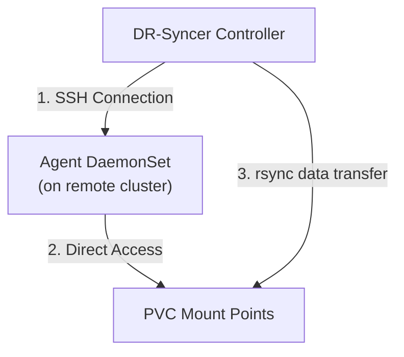
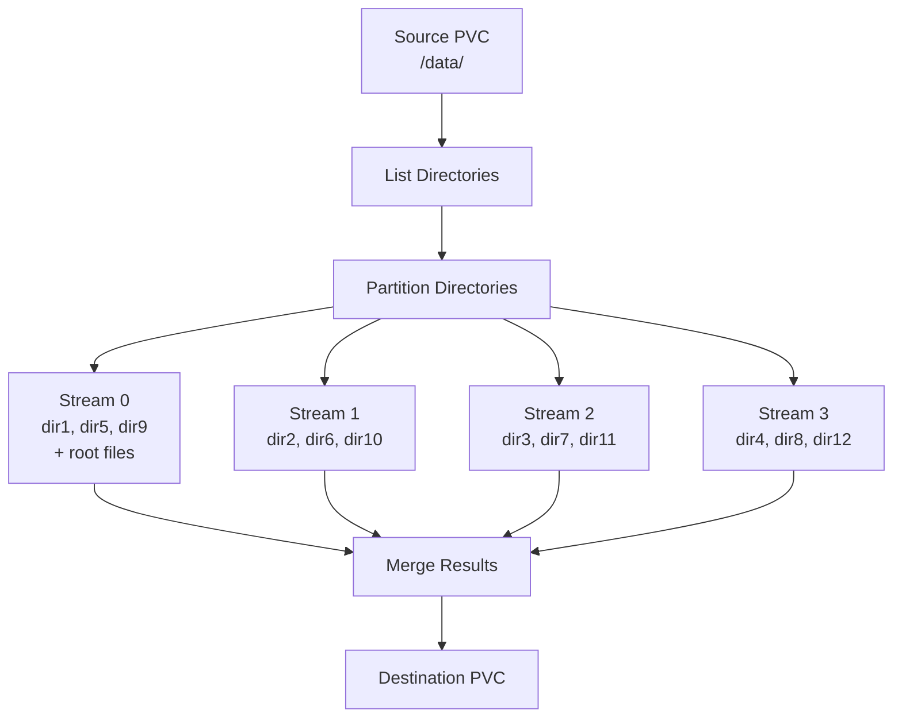
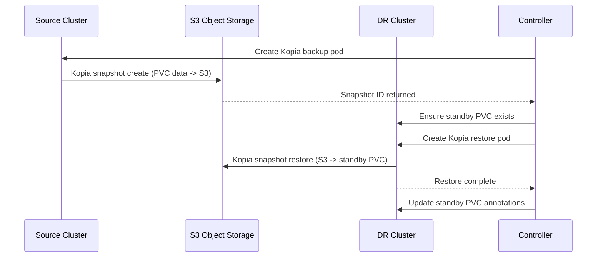
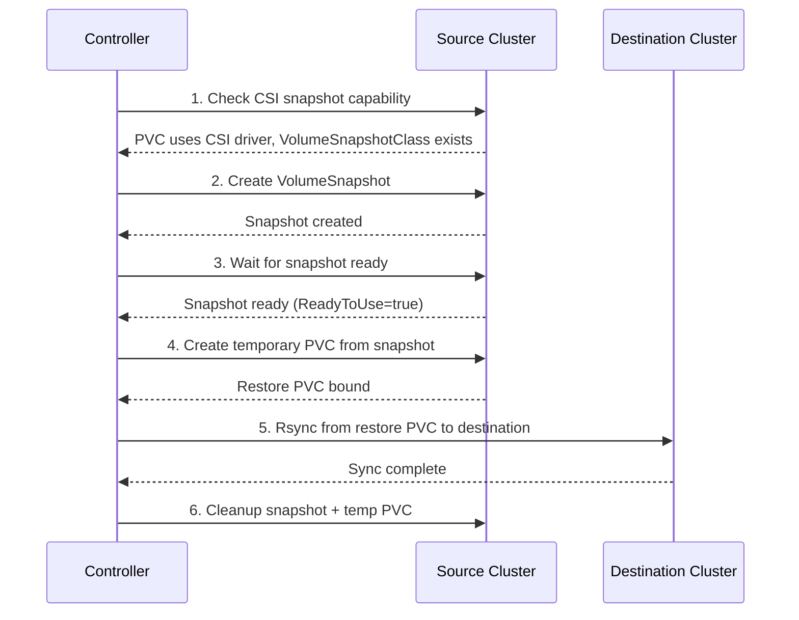

# Features

DR-Syncer provides a comprehensive set of features designed to streamline the disaster recovery process for Kubernetes clusters. This page details each feature and explains how they work together to create a reliable disaster recovery solution.

## Resource Synchronization

The core functionality of DR-Syncer is its ability to synchronize resources between Kubernetes clusters, ensuring your DR environment accurately reflects your production environment.

### Supported Resource Types

DR-Syncer can synchronize various Kubernetes resource types between clusters, including:

| Resource Type | Synchronization Details |
|---------------|-------------------------|
| ConfigMaps | Configuration data with exact content matching |
| Secrets | Encrypted data with secure handling |
| Deployments | Application deployments with scale control |
| StatefulSets | Stateful applications with ordered pod management |
| DaemonSets | Node-level services synchronized to destination cluster |
| Services | Network services with appropriate transformation |
| Ingresses | External access rules with annotation handling |
| PersistentVolumeClaims | Storage claims with optional data replication |
| Custom Resources | Extended Kubernetes resources with schema preservation |

Resource synchronization is implemented through the Kubernetes API, ensuring all resources are managed through native mechanisms.


```mermaid
flowchart LR
    Source["Source Resources"] --> Controller["DR-Syncer Controller"]
    Controller --> Transform["Resource Transformation"]
    Transform --> Apply["Apply to Destination"]
    Apply --> Status["Status Update"]
```

### Filtering Capabilities

DR-Syncer provides granular control over which resources are synchronized:

- **Resource Type Filtering**: Specify exactly which resource types to synchronize in the Replication CRD:
  ```yaml
  resourceTypes:
    - ConfigMap
    - Secret
    - Deployment
    - Service
  ```

- **Label-based Filtering**: Include or exclude resources based on labels. Resources with the `dr-syncer.io/ignore: "true"` label are automatically excluded from synchronization.
  ```yaml
  excludeLabels:
    - key: dr-syncer.io/ignore
      value: "true"
    - key: environment
      value: "dev-only"
  ```

- **Namespace Selection**: Synchronize resources between specific namespaces:
  ```yaml
  sourceNamespace: production
  destinationNamespace: production-dr
  ```

- **Resource Exclusion**: Explicitly exclude specific resources from synchronization:
  ```yaml
  excludeResources:
    - name: sensitive-secret
      kind: Secret
    - name: local-only-config
      kind: ConfigMap
  ```

### Metadata Handling

DR-Syncer carefully manages resource metadata during synchronization:

- **Metadata Preservation**: Maintains important metadata like labels and annotations
- **Resource Versioning**: Handles resource versions to prevent conflicts and API server rejections
- **Ownership References**: Updates owner references when synchronizing dependent resources
- **Immutable Fields**: Special handling for immutable fields that cannot be changed after creation
- **Status Synchronization**: Preserves or updates status fields according to configuration

Example of metadata handling in synchronization:
```go
// Simplified example of metadata handling
func syncResource(source, destination *unstructured.Unstructured) {
    // Preserve existing immutable fields
    if value, exists := destination.GetAnnotations()["immutable-fields"]; exists {
        immutableFields := strings.Split(value, ",")
        for _, field := range immutableFields {
            // Preserve the immutable field from destination
            fieldValue, found, _ := unstructured.NestedFieldCopy(destination.Object, strings.Split(field, ".")...)
            if found {
                unstructured.SetNestedField(source.Object, fieldValue, strings.Split(field, ".")...)
            }
        }
    }
    
    // Add synchronization annotations
    annotations := source.GetAnnotations()
    if annotations == nil {
        annotations = make(map[string]string)
    }
    annotations["dr-syncer.io/last-synced"] = time.Now().Format(time.RFC3339)
    annotations["dr-syncer.io/source-cluster"] = controllerClusterName
    source.SetAnnotations(annotations)
}
```

## Synchronization Modes

DR-Syncer supports multiple synchronization modes to fit diverse disaster recovery requirements and operational preferences.

### Continuous Mode

Continuous mode provides real-time synchronization of resources between clusters:

- **How it works**: The controller watches for changes to resources in the source namespace and immediately synchronizes those changes to the destination cluster
- **Benefits**: Minimal recovery point objective (RPO), ensuring the DR environment is always current
- **Implementation**: Uses Kubernetes watch API to detect changes and triggers immediate reconciliation
- **Resource efficiency**: Implements smart detection to avoid unnecessary synchronizations
- **Change detection**: Identifies meaningful changes that require synchronization versus metadata updates that can be ignored

Configure continuous mode in the Replication resource:
```yaml
spec:
  sync:
    mode: Continuous
```

### Scheduled Mode

Scheduled mode enables periodic synchronization on a defined schedule:

- **Cron-based scheduling**: Uses standard cron expressions for flexible scheduling
- **Schedule examples**:
  - Every 6 hours: `0 */6 * * *`
  - Daily at midnight: `0 0 * * *`
  - Every Monday at 2am: `0 2 * * 1`
- **Bandwidth efficiency**: Ideal for environments where continuous synchronization would consume excessive bandwidth
- **Controlled updates**: Predictable synchronization windows for monitoring and validation
- **Implementation**: Uses controller-based cron parsing and execution with jitter to prevent thundering herd problems

Configure scheduled mode with a cron expression:
```yaml
spec:
  sync:
    mode: Scheduled
    schedule: "0 */6 * * *"  # Every 6 hours
```

### Manual Mode

Manual mode provides on-demand synchronization triggered by administrators:

- **Use cases**: 
  - DR testing scenarios
  - Pre-maintenance synchronization
  - Controlled updates during maintenance windows
- **Annotation-triggered**: Add or update the `dr-syncer.io/sync-now: "true"` annotation to trigger synchronization
- **Status tracking**: Detailed status reporting for manual synchronization operations
- **Implementation**: Watch for annotation changes on the Replication resource

Configure manual mode:
```yaml
spec:
  sync:
    mode: Manual
```

Trigger a manual synchronization:
```bash
kubectl annotate replication production-to-dr dr-syncer.io/sync-now="true" --overwrite
```

### Mode Comparison

| Feature | Continuous | Scheduled | Manual |
|---------|------------|-----------|--------|
| Recovery Point Objective | Lowest (near real-time) | Depends on schedule | Highest (manual only) |
| Network bandwidth usage | Highest | Moderate | Lowest |
| Operational control | Automated | Predictable | Full control |
| Best for | Critical systems | Standard DR | Testing & maintenance |
| Resource usage | Higher | Moderate | Lowest |

## Deployment Management

DR-Syncer intelligently handles deployment resources with DR-specific optimizations that balance recovery readiness with resource efficiency.

### Scale Control

The default behavior scales down deployments to zero replicas in DR clusters, while preserving the ability to quickly scale up when needed:

- **Zero-Replica Default**: By default, deployments are synchronized with zero replicas in DR clusters to conserve resources:
  ```go
  // Simplified version of replica handling logic
  if isDeployment(resource) && config.ScaleToZero {
      // Store original replica count in annotation
      originalReplicas, _, _ := unstructured.NestedInt64(resource.Object, "spec", "replicas")
      annotations := resource.GetAnnotations()
      if annotations == nil {
          annotations = make(map[string]string)
      }
      annotations["dr-syncer.io/original-replicas"] = strconv.FormatInt(originalReplicas, 10)
      resource.SetAnnotations(annotations)
      
      // Set replicas to zero
      unstructured.SetNestedField(resource.Object, int64(0), "spec", "replicas")
  }
  ```

- **Scale Override via Labels**: Keep specific deployments at their original scale using the `dr-syncer.io/scale-override: "true"` label:
  ```yaml
  apiVersion: apps/v1
  kind: Deployment
  metadata:
    name: critical-service
    labels:
      dr-syncer.io/scale-override: "true"  # This deployment will keep its original replica count
  spec:
    replicas: 3
    # ... rest of deployment spec
  ```

- **Original Scale Preservation**: Annotations store the original replica count for quick recovery:
  ```yaml
  apiVersion: apps/v1
  kind: Deployment
  metadata:
    name: app-deployment
    annotations:
      dr-syncer.io/original-replicas: "3"  # Original replica count preserved here
  spec:
    replicas: 0  # Scaled to zero in DR
    # ... rest of deployment spec
  ```

- **DR Activation**: During DR activation, quickly restore replica counts with a simple command:
  ```bash
  kubectl get deployments -n production-dr -o json | \
    jq '.items[] | select(.metadata.annotations."dr-syncer.io/original-replicas" != null) | 
    .metadata.name + " " + .metadata.annotations."dr-syncer.io/original-replicas"' | \
    xargs -n 2 sh -c 'kubectl scale deployment $0 --replicas=$1 -n production-dr'
  ```

### Resource Configuration

DR-Syncer preserves all deployment configuration while applying DR-specific transformations:

- **Resource Requests/Limits**: By default, preserves resource specifications exactly:
  ```yaml
  resources:
    limits:
      cpu: "1"
      memory: "1Gi"
    requests:
      cpu: "200m"
      memory: "256Mi"
  ```

- **Environment Variables**: Maintains environment variables for identical application behavior:
  ```yaml
  env:
    - name: DATABASE_URL
      valueFrom:
        secretKeyRef:
          name: db-credentials
          key: url
  ```

- **Volume Mounts**: Preserves volume configurations with appropriate storage class mapping:
  ```yaml
  volumeMounts:
    - name: data-volume
      mountPath: /data
  volumes:
    - name: data-volume
      persistentVolumeClaim:
        claimName: app-data  # This reference is automatically updated if needed
  ```

- **Configuration Transformation**: Supports custom transformations via annotations for environment-specific changes:
  ```yaml
  metadata:
    annotations:
      dr-syncer.io/transform-env: "PRODUCTION_URL:DR_URL,PROD_MODE:DR_MODE"
  ```

## PVC Synchronization

DR-Syncer's PVC synchronization capabilities extend beyond simple resource replication to include the actual data stored in persistent volumes, addressing a critical gap in traditional Kubernetes DR solutions.

### Data Replication Architecture

Data replication is implemented using a secure agent architecture:


```mermaid
flowchart TD
    Controller["DR-Syncer Controller"] -- "1. SSH Connection" --> Agent["Agent DaemonSet<br/>(on remote cluster)"]
    Agent -- "2. Direct Access" --> PVCMounts["PVC Mount Points"]
    Controller -- "3. rsync data transfer" --> PVCMounts
```

The data replication process follows these steps:

1. **Discovery**: Identify PVCs to synchronize based on Replication configuration
2. **PVC Creation**: Ensure destination PVCs exist with correct configuration
3. **Connection**: Establish secure SSH connection to agent in destination cluster
4. **Rsync Transfer**: Use rsync over SSH to efficiently transfer data
5. **Verification**: Validate successful data transfer

### Data Replication Features

- **Secure SSH-based rsync**: Industry-standard secure data transfer mechanism:
  ```
  rsync -avz --delete -e "ssh -p 2222 -i /path/to/key -o StrictHostKeyChecking=no" /source/path/ user@agent-host:/destination/path/
  ```

- **Incremental Synchronization**: Only transfers changed data blocks to minimize bandwidth usage and time:
  ```
  # rsync calculates differences with checksums and timestamps
  # Example of small incremental transfer details:
  #
  # sent 1,854 bytes  received 898 bytes  1,836.00 bytes/sec
  # total size is 5,242,880  speedup is 1,902.13
  ```

- **Bandwidth Control**: Rate limiting options to prevent network saturation
  ```
  # Configure rate limiting with --bwlimit option
  rsync --bwlimit=10000  # Limit to 10MB/sec
  ```

- **Automatic Retry**: Built-in exponential backoff retry mechanism:
  ```go
  // Simplified retry logic
  backoff := wait.Backoff{
      Duration: 5 * time.Second,
      Factor:   2.0,
      Jitter:   0.1,
      Steps:    5,
  }
  
  err := retry.OnError(backoff, func() error {
      return syncPVCData(source, destination)
  })
  ```

### Storage Management

DR-Syncer provides sophisticated storage management capabilities:

- **Storage Class Mapping**: Maps between different storage classes in different environments:
  ```yaml
  pvcConfig:
    storageClassMapping:
      fast-ssd: standard-dr
      local-storage: remote-storage
  ```

- **Access Mode Handling**: Converts between different access modes based on target cluster capabilities:
  ```yaml
  pvcConfig:
    accessModeMapping:
      ReadWriteOnce: ReadWriteMany  # Convert RWO volumes to RWM in DR
  ```

- **Volume Size Management**: Ensures destination volumes have sufficient capacity:
  ```yaml
  # Source PVC
  spec:
    resources:
      requests:
        storage: 10Gi
  
  # Destination PVC automatically created with same or mapped size
  ```

- **Dynamic Provisioning**: Works with dynamically provisioned volumes using appropriate storage classes:
  ```yaml
  # The controller automatically requests appropriate storage class provisioning
  ```

### Security Features

DR-Syncer implements robust security for PVC data replication:

- **SSH Key Management**:
  - Secure key generation with proper permissions
  - Keys stored as Kubernetes secrets with appropriate RBAC
  - Regular key rotation capabilities
  - Fingerprint tracking for key verification

- **Agent Security Model**:
  - Agent runs with minimal privileges (non-root)
  - Direct access to mounted PVCs without requiring root access
  - SSH configuration restricts allowed commands
  - Comprehensive logging and audit trail

- **Command Restriction**:
  ```
  # In authorized_keys file
  command="rsync --server -vlogDtprze.iLsfxC . /path",no-port-forwarding,no-X11-forwarding,no-agent-forwarding,no-pty ssh-rsa AAAA...
  ```

- **Secure Communication**:
  - TLS encryption for all communication
  - SSH tunneling for data transfer
  - Strict host key checking options

### Parallel Rsync for Large PVCs

For large PVCs with many subdirectories, DR-Syncer supports parallel rsync streams to dramatically improve sync throughput. This feature partitions top-level directories across multiple concurrent rsync processes.

#### Configuration

Enable parallel rsync in the NamespaceMapping's `pvcConfig.dataSyncConfig`:

```yaml
spec:
  pvcConfig:
    dataSyncConfig:
      parallelConfig:
        streams: 4           # Number of concurrent rsync streams (1-8)
        failureMode: fail-all  # How to handle stream failures
```

#### Configuration Fields

| Field | Type | Default | Description |
|-------|------|---------|-------------|
| `streams` | Integer | 1 | Number of parallel rsync processes (1-8) |
| `failureMode` | String | fail-all | Failure handling: `fail-all` or `continue` |

#### How It Works

1. **Directory Discovery**: The controller lists top-level directories in the source PVC
2. **Round-Robin Partitioning**: Directories are distributed evenly across streams
3. **Concurrent Execution**: Each stream runs an rsync process with filters for its assigned directories
4. **Stream 0 Special Handling**: Stream 0 also syncs root-level files (not in subdirectories)
5. **Bandwidth Division**: Total bandwidth limit is divided equally among streams


```mermaid
flowchart TD
    Source["Source PVC<br/>/data/"] --> Discover["List Directories"]
    Discover --> Partition["Partition Directories"]
    Partition --> S0["Stream 0<br/>dir1, dir5, dir9<br/>+ root files"]
    Partition --> S1["Stream 1<br/>dir2, dir6, dir10"]
    Partition --> S2["Stream 2<br/>dir3, dir7, dir11"]
    Partition --> S3["Stream 3<br/>dir4, dir8, dir12"]
    S0 --> Merge["Merge Results"]
    S1 --> Merge
    S2 --> Merge
    S3 --> Merge
    Merge --> Dest["Destination PVC"]
```

#### Failure Modes

| Mode | Behavior |
|------|----------|
| `fail-all` (default) | If any stream fails, cancel all other streams and fail the entire sync |
| `continue` | Continue remaining streams on failure, report partial success if some streams complete |

#### Example: High-Throughput Data Sync

```yaml
apiVersion: dr-syncer.io/v1alpha1
kind: NamespaceMapping
metadata:
  name: large-data-replication
spec:
  sourceNamespace: data-warehouse
  destinationNamespace: data-warehouse-dr
  destinationCluster: dr-cluster
  resourceTypes:
    - PersistentVolumeClaim
  pvcConfig:
    dataSyncConfig:
      parallelConfig:
        streams: 8           # Maximum parallelism
        failureMode: continue  # Continue even if some streams fail
      bandwidthLimit: 102400  # 100 MB/s total (divided across streams)
      timeout: "2h"
```

#### Performance Considerations

- **When to use**: PVCs with many top-level directories (e.g., `/data/user1/`, `/data/user2/`, etc.)
- **Optimal streams**: Set streams ≤ number of top-level directories for best efficiency
- **Bandwidth**: Total bandwidth is divided by stream count (e.g., 100 MB/s ÷ 4 streams = 25 MB/s per stream)
- **Overhead**: Each stream adds some SSH/rsync connection overhead; 4-8 streams is usually optimal

#### Monitoring Parallel Syncs

Watch parallel sync progress via PVCSyncOperation:

```bash
# View aggregate progress across all streams
kubectl get ps -n dr-syncer-system -w

# Check stream-level logs
kubectl logs -n dr-syncer-system -l app.kubernetes.io/name=dr-syncer | grep "stream"
```

The controller logs detailed information about stream assignments and results:

```
INFO  Starting parallel rsync workflow  pvc=large-data streams=4 failure_mode=fail-all
INFO  Partitioned directories for parallel sync  actual_streams=4
INFO  Stream completed  stream=0 bytes_transferred=1073741824 files_transferred=1500 duration=5m30s
INFO  Stream completed  stream=1 bytes_transferred=858993459 files_transferred=1200 duration=4m45s
...
INFO  Parallel rsync completed  total_bytes=3435973836 total_files=4800 duration=5m45s streams_used=4 streams_failed=0
```

## Backup-Based PVC Sync (Kopia)

In addition to rsync-based data replication, DR-Syncer supports an S3-mediated backup path using [Kopia](https://kopia.io/). This path is ideal for multi-region DR, air-gapped environments, or when near-instant cutover is required.

### How It Works

The backup path uses Kopia to snapshot PVC data to S3, then restores it to pre-provisioned "standby" PVCs on the DR cluster. During cutover, workload volume references are rewritten to point at the standby PVCs, enabling near-instant failover.


```mermaid
sequenceDiagram
    participant S as Source Cluster
    participant O as S3 Object Storage
    participant D as DR Cluster
    participant C as Controller

    C->>S: Create Kopia backup pod
    S->>O: Kopia snapshot create (PVC data -> S3)
    O-->>C: Snapshot ID returned
    C->>D: Ensure standby PVC exists
    C->>D: Create Kopia restore pod
    D->>O: Kopia snapshot restore (S3 -> standby PVC)
    D-->>C: Restore complete
    C->>D: Update standby PVC annotations
```

### Enabling Backup-Based Sync

Configure the `backupConfig` in your NamespaceMapping:

```yaml
apiVersion: dr-syncer.io/v1alpha1
kind: NamespaceMapping
metadata:
  name: production-sync
spec:
  sourceNamespace: production
  destinationNamespace: production-dr
  pvcConfig:
    syncData: true
    dataSyncConfig:
      backupConfig:
        enabled: true
        backupRepositoryRef:
          name: my-backup-repo
          namespace: dr-syncer-system
        dataAccessStrategy: Auto        # Auto | Snapshot | Live
        parallelism: 4                  # Kopia parallel streams (1-16)
        compressionAlgorithm: zstd      # zstd | s2 | gzip | none
        standbyPVCConfig:
          enabled: true                 # Create standby PVCs (default: true)
          storageClassName: "gp3"       # Override destination storage class
```

### BackupRepository Setup

Create a `BackupRepository` resource referencing your S3 bucket and encryption credentials:

```yaml
apiVersion: dr-syncer.io/v1alpha1
kind: BackupRepository
metadata:
  name: my-backup-repo
  namespace: dr-syncer-system
spec:
  s3Config:
    endpoint: s3.amazonaws.com
    bucket: dr-syncer-backups
    region: us-east-1
    pathPrefix: cluster-prod/
    credentialsSecretRef:
      name: s3-credentials
      namespace: dr-syncer-system
  kopiaConfig:
    encryptionSecretRef:
      name: kopia-encryption
      namespace: dr-syncer-system
    compressionAlgorithm: zstd
  retentionPolicy:
    keepLatest: 10
    keepDaily: 7
    keepWeekly: 4
    keepMonthly: 12
```

Required secrets:
- **S3 credentials**: Secret with `accessKeyID` and `secretAccessKey` keys (mapped to env vars `AWS_ACCESS_KEY_ID` and `AWS_SECRET_ACCESS_KEY`)
- **Kopia encryption**: Secret with `password` key (mapped to env var `KOPIA_PASSWORD`)

### Standby PVCs

Standby PVCs are pre-provisioned on the DR cluster with the naming convention `<source-pvc>-standby`. They are automatically created and continuously restored from the latest Kopia snapshots.

**Labels** on standby PVCs:
- `dr-syncer.io/managed-by: dr-syncer`
- `dr-syncer.io/standby: "true"`
- `dr-syncer.io/source-pvc: <source-pvc-name>`

**Annotations** updated on each restore:
- `dr-syncer.io/last-restore-time: <timestamp>`
- `dr-syncer.io/last-restore-snapshot-id: <snapshot-id>`

### Data Access Strategies

| Strategy | Description | Use Case |
|----------|-------------|----------|
| **Auto** (default) | Detects CSI snapshot support; uses Snapshot if available, otherwise Live | Most deployments |
| **Snapshot** | Creates a CSI VolumeSnapshot for point-in-time consistent backup | Production databases |
| **Live** | Mounts PVC directly (pins Kopia pod to same node as consumer) | Dev/test, fast sync |

### Cutover with Standby PVCs

During cutover, the CLI validates and rewrites workload volume references:

1. **Validation**: All standby PVCs must be `Bound` and have been restored at least once
2. **Rewrite**: Deployment and StatefulSet `volume.persistentVolumeClaim.claimName` values are changed from source to standby PVC names
3. **Scale**: Source scaled to 0, destination scaled to original replica counts

```bash
dr-syncer-cli cutover --mapping production-sync --use-standby-pvcs
```

During failback, the process reverses: workload volumes are rewritten back to original PVC names.

### Comparison: Backup vs Rsync

| Feature | Backup (Kopia) | Rsync |
|---------|----------------|-------|
| Network requirement | S3 access only | Direct cluster-to-cluster |
| Cutover time | Near-instant (data pre-staged) | Depends on data size |
| Point-in-time recovery | Yes (snapshot history) | No |
| Deduplication | Yes (Kopia built-in) | No |
| Multi-region support | Excellent | Limited by latency |
| S3 cost | Yes | None |
| Operational complexity | Higher | Lower |

For detailed architecture documentation, see [docs/DESIGN.md](../DESIGN.md).

## CSI Snapshot Integration

DR-Syncer supports CSI snapshot-based sync for point-in-time consistent data replication. Instead of syncing from live PVC data (which may change during sync), snapshots provide a frozen point-in-time view of the data.

### Why Use Snapshots?

| Approach | Consistency | Data Integrity | Use Case |
|----------|-------------|----------------|----------|
| **Live Sync** | Application must quiesce writes | May have torn writes | Development, test data |
| **Snapshot Sync** | Point-in-time consistent | Guaranteed consistent | Production databases, stateful apps |

### Configuration

Enable snapshot-based sync in your NamespaceMapping:

```yaml
apiVersion: dr-syncer.io/v1alpha1
kind: NamespaceMapping
metadata:
  name: production-sync
spec:
  sourceNamespace: production
  destinationNamespace: production-dr
  pvcConfig:
    syncData: true
    dataSyncConfig:
      snapshotConfig:
        enabled: true
        volumeSnapshotClassName: "csi-aws-vsc"  # Optional: auto-detect if omitted
        snapshotTimeout: "10m"                   # Default: 5m
        fallbackToLive: true                     # Default: true
```

### Configuration Fields

| Field | Type | Default | Description |
|-------|------|---------|-------------|
| `enabled` | bool | `false` | Enable snapshot-based sync |
| `volumeSnapshotClassName` | string | (auto-detect) | VolumeSnapshotClass to use. If empty, auto-detects based on CSI driver |
| `snapshotTimeout` | duration | `5m` | Maximum time to wait for snapshot to become ready |
| `fallbackToLive` | bool | `true` | Fall back to live sync if snapshot fails |

### How It Works

The snapshot sync workflow follows these steps:


```mermaid
sequenceDiagram
    participant C as Controller
    participant S as Source Cluster
    participant D as Destination Cluster

    C->>S: 1. Check CSI snapshot capability
    S-->>C: PVC uses CSI driver, VolumeSnapshotClass exists
    C->>S: 2. Create VolumeSnapshot
    S-->>C: Snapshot created
    C->>S: 3. Wait for snapshot ready
    S-->>C: Snapshot ready (ReadyToUse=true)
    C->>S: 4. Create temporary PVC from snapshot
    S-->>C: Restore PVC bound
    C->>D: 5. Rsync from restore PVC to destination
    D-->>C: Sync complete
    C->>S: 6. Cleanup snapshot + temp PVC
```

#### Detailed Workflow

1. **Capability Check**: Controller verifies:
   - PVC is bound to a PV
   - PV uses a CSI driver
   - A VolumeSnapshotClass exists for the CSI driver

2. **Snapshot Creation**: Creates VolumeSnapshot with naming pattern:
   ```
   dr-syncer-snap-{pvc-name}-{timestamp}
   ```

3. **Wait for Ready**: Polls snapshot status until `ReadyToUse=true` or timeout

4. **Restore to Temp PVC**: Creates temporary PVC from snapshot:
   ```
   dr-syncer-snap-restore-{pvc-name}-{hash}
   ```

5. **Rsync from Snapshot**: Syncs data from the frozen snapshot PVC

6. **Cleanup**: Deletes temporary PVC and snapshot

### CSI Driver Requirements

Snapshot support requires:

1. **CSI Driver with Snapshot Support**: Your storage driver must support the `CREATE_DELETE_SNAPSHOT` capability
2. **VolumeSnapshotClass**: A VolumeSnapshotClass must be defined for your CSI driver
3. **snapshot-controller**: The Kubernetes snapshot controller must be deployed

#### Common CSI Drivers with Snapshot Support

| Provider | CSI Driver | VolumeSnapshotClass Example |
|----------|------------|---------------------------|
| AWS EBS | `ebs.csi.aws.com` | `csi-aws-vsc` |
| GCE PD | `pd.csi.storage.gke.io` | `csi-gce-pd-vsc` |
| Azure Disk | `disk.csi.azure.com` | `csi-azure-vsc` |
| Longhorn | `driver.longhorn.io` | `longhorn-snapshot-vsc` |
| OpenEBS | `cstor.csi.openebs.io` | `cstor-csi-vsc` |

### Auto-Detection

When `volumeSnapshotClassName` is not specified, DR-Syncer automatically:

1. Gets the PV bound to the PVC
2. Extracts the CSI driver name from the PV
3. Lists all VolumeSnapshotClasses
4. Selects the first VolumeSnapshotClass matching the CSI driver

### Fallback Behavior

When `fallbackToLive: true` (default):

| Scenario | Behavior |
|----------|----------|
| PVC not using CSI driver | Falls back to live sync |
| No VolumeSnapshotClass found | Falls back to live sync |
| Snapshot creation fails | Falls back to live sync |
| Snapshot timeout exceeded | Falls back to live sync |
| Restore PVC binding fails | Falls back to live sync |

When `fallbackToLive: false`:

| Scenario | Behavior |
|----------|----------|
| Any snapshot failure | Sync fails with error |

### Status Tracking

Snapshot information is tracked in PVCSyncOperation status:

```yaml
status:
  snapshotInfo:
    snapshotName: "dr-syncer-snap-mydata-20251230-143022"
    snapshotReadyTime: "2025-12-30T14:30:25Z"
    snapshotSize: 10737418240  # 10 GB
    restorePVCName: "dr-syncer-snap-restore-mydata-a1b2c3d4"
```

### Monitoring

Check snapshot sync status:

```bash
# View PVC sync operations with snapshot info
kubectl get pvcsyncoperations -o wide

# Check for snapshot-related events
kubectl get events --field-selector reason=SnapshotCreated

# View controller logs for snapshot workflow
kubectl logs -n dr-syncer-system -l app.kubernetes.io/name=dr-syncer | grep snapshot
```

### Troubleshooting

| Issue | Cause | Solution |
|-------|-------|----------|
| "No VolumeSnapshotClass found" | Missing snapshot class | Create VolumeSnapshotClass for your CSI driver |
| "PV does not use CSI driver" | Legacy in-tree provisioner | Migrate to CSI driver or use live sync |
| "Snapshot timeout exceeded" | Large PVC or slow storage | Increase `snapshotTimeout` |
| "Restore PVC binding failed" | Storage capacity issues | Check destination cluster storage |

### Example: Full Snapshot Configuration

```yaml
apiVersion: dr-syncer.io/v1alpha1
kind: NamespaceMapping
metadata:
  name: database-dr-sync
spec:
  sourceNamespace: databases
  destinationNamespace: databases-dr
  pvcConfig:
    syncData: true
    dataSyncConfig:
      concurrentSyncs: 2
      bandwidthLimit: 102400  # 100 MB/s
      timeout: "2h"
      snapshotConfig:
        enabled: true
        volumeSnapshotClassName: "csi-aws-vsc"
        snapshotTimeout: "15m"
        fallbackToLive: false  # Require snapshot for databases
      parallelConfig:
        streams: 4
        failureMode: "fail-all"
```

This configuration:
- Enables snapshot-based sync for point-in-time consistency
- Uses AWS EBS CSI snapshot class
- Allows 15 minutes for snapshot creation
- **Fails sync** if snapshot cannot be created (no fallback for database consistency)
- Uses 4 parallel rsync streams for faster transfer

## Rsync DaemonSet Pool

DR-Syncer uses a DaemonSet pool architecture for efficient PVC data synchronization. Instead of creating a new rsync pod for each sync operation (which incurs 1-5 minute startup overhead), the DaemonSet maintains pre-deployed rsync pods on every destination cluster node.

### Why DaemonSet Pool?

| Approach | Startup Time | Resource Usage | Use Case |
|----------|-------------|----------------|----------|
| **Per-sync Deployment** | 1-5 minutes | Dynamic | Small clusters, infrequent syncs |
| **DaemonSet Pool** | 0 seconds | Constant | Production, frequent syncs |

### Configuration

Configure the DaemonSet pool in your RemoteCluster resource:

```yaml
apiVersion: dr-syncer.io/v1alpha1
kind: RemoteCluster
metadata:
  name: dr-cluster
spec:
  kubeconfig:
    secretRef:
      name: dr-cluster-kubeconfig
  pvcSync:
    enabled: true
    rsyncDaemonSet:
      enabled: true                    # Default: true
      image: "supporttools/dr-syncer-rsync:latest"
      namespace: "dr-syncer-system"    # Default: dr-syncer-system
      sshSecretName: "dr-syncer-rsync-ssh-keys"
```

### Configuration Fields

| Field | Type | Default | Description |
|-------|------|---------|-------------|
| `enabled` | bool | `true` | Enable DaemonSet pool (enabled by default) |
| `image` | string | `supporttools/dr-syncer-rsync:latest` | Container image for rsync pods |
| `namespace` | string | `dr-syncer-system` | Namespace for DaemonSet deployment |
| `sshSecretName` | string | `dr-syncer-rsync-ssh-keys` | Secret containing SSH keys for authentication |

### Architecture

The DaemonSet pool architecture provides:

```
Destination Cluster
┌─────────────────────────────────────────────────────────────┐
│                                                             │
│  ┌─────────────────┐ ┌─────────────────┐ ┌─────────────────┐│
│  │     Node 1      │ │     Node 2      │ │     Node 3      ││
│  │  ┌───────────┐  │ │  ┌───────────┐  │ │  ┌───────────┐  ││
│  │  │ rsync pod │  │ │  │ rsync pod │  │ │  │ rsync pod │  ││
│  │  │ (running) │  │ │  │ (running) │  │ │  │ (running) │  ││
│  │  └───────────┘  │ │  └───────────┘  │ │  └───────────┘  ││
│  │       │         │ │       │         │ │       │         ││
│  │       ▼         │ │       ▼         │ │       ▼         ││
│  │  /var/lib/      │ │  /var/lib/      │ │  /var/lib/      ││
│  │   kubelet       │ │   kubelet       │ │   kubelet       ││
│  │  (host mount)   │ │  (host mount)   │ │  (host mount)   ││
│  └─────────────────┘ └─────────────────┘ └─────────────────┘│
│                                                             │
│  DaemonSet: dr-syncer-rsync                                 │
│  Namespace: dr-syncer-system                                │
└─────────────────────────────────────────────────────────────┘
```

### How It Works

1. **DaemonSet Deployment**: When a RemoteCluster is created, the controller deploys the rsync DaemonSet to the destination cluster

2. **Pod Discovery**: For each PVC sync, the controller:
   - Determines which node the destination PVC is bound to
   - Finds the DaemonSet pod running on that node

3. **Path Resolution** (Hybrid Approach):
   - **Fast Path**: Check if PVC is already mounted via CSI (existing workload)
   - **Slow Path**: Create temporary placeholder pod to mount the PVC

4. **Rsync Execution**: Execute rsync from source agent to DaemonSet pod

5. **Cleanup**: Only temporary resources (placeholder pods) are cleaned up; DaemonSet pods remain running

### DaemonSet Pod Specification

The DaemonSet pods are configured for secure, efficient rsync operations:

```yaml
spec:
  hostNetwork: true           # Direct node network access
  dnsPolicy: ClusterFirstWithHostNet
  containers:
  - name: rsync
    image: supporttools/dr-syncer-rsync:latest
    command: ["sleep", "infinity"]  # Waits for rsync commands
    volumeMounts:
    - name: kubelet
      mountPath: /var/lib/kubelet   # Access to all PVC data
    - name: ssh-keys
      mountPath: /root/.ssh         # Pre-mounted SSH keys
    securityContext:
      privileged: true
      runAsUser: 0
    resources:
      requests:
        cpu: 100m
        memory: 128Mi
      limits:
        cpu: 2
        memory: 2Gi
  tolerations:
  - key: node-role.kubernetes.io/master
    operator: Exists
    effect: NoSchedule
  - key: node-role.kubernetes.io/control-plane
    operator: Exists
    effect: NoSchedule
```

### Pre-mounted SSH Keys

Unlike per-sync deployments that must distribute SSH keys for each operation, DaemonSet pods have SSH keys pre-mounted:

```yaml
volumes:
- name: ssh-keys
  secret:
    secretName: dr-syncer-rsync-ssh-keys
    defaultMode: 0600    # Secure permissions
    optional: true       # Backward compatibility
```

This eliminates the SSH key distribution step from the sync workflow, saving additional time.

### Path Resolution Strategies

The DaemonSet uses a hybrid path resolution approach:

| Strategy | When Used | Overhead | Description |
|----------|-----------|----------|-------------|
| **CSI Path** | PVC mounted by workload | None | Uses existing kubelet CSI mount path |
| **Placeholder Pod** | PVC not mounted | ~2 min | Creates temporary pod to mount PVC |

```go
// Fast path: CSI mount already exists
csiPath, err := tempod.FindCSIPath(ctx, client, namespace, pvcName, nodeName)
if err == nil {
    return csiPath, nil, nil  // No cleanup needed
}

// Slow path: Create placeholder pod
placeholderPod, err := tempod.CreatePlaceholderPod(ctx, client, namespace, pvcName, nodeName)
```

### Performance Benefits

| Metric | Per-Sync Deployment | DaemonSet Pool |
|--------|--------------------|--------------------|
| Pod startup | 1-5 min | 0 sec |
| Image pull | Per sync (if not cached) | Once per node |
| SSH key setup | Per sync | Pre-mounted |
| Total overhead | 2-6 min | 0-2 min (only if placeholder needed) |

### Monitoring

Check DaemonSet status:

```bash
# View DaemonSet status
kubectl get daemonset -n dr-syncer-system dr-syncer-rsync

# Check pods on all nodes
kubectl get pods -n dr-syncer-system -l app.kubernetes.io/name=dr-syncer-rsync -o wide

# View DaemonSet logs
kubectl logs -n dr-syncer-system -l app.kubernetes.io/name=dr-syncer-rsync --tail=100
```

Expected output:

```
NAME              DESIRED   CURRENT   READY   UP-TO-DATE   AVAILABLE   NODE SELECTOR   AGE
dr-syncer-rsync   3         3         3       3            3           <none>          24h
```

### Disabling DaemonSet Pool

For smaller clusters or when you prefer per-sync deployments:

```yaml
spec:
  pvcSync:
    enabled: true
    rsyncDaemonSet:
      enabled: false   # Disable DaemonSet pool
```

When disabled, the controller falls back to creating individual rsync deployments per sync operation.

### Troubleshooting

| Issue | Cause | Solution |
|-------|-------|----------|
| "No running rsync DaemonSet pod found" | DaemonSet not deployed or pods not ready | Check DaemonSet status, verify image pull |
| "Failed to find CSI path" | PVC not mounted on node | Verify PVC binding, check node affinity |
| SSH authentication failures | Secret not mounted or missing | Verify `sshSecretName` exists and has correct keys |
| High memory usage | Large file transfers | Adjust resource limits in DaemonSet spec |

## Data Verification Modes

DR-Syncer provides three verification modes to ensure data integrity during PVC synchronization. Each mode offers different trade-offs between speed and thoroughness.

### Verification Mode Overview

| Mode | Method | Speed | Integrity Guarantee | Use Case |
|------|--------|-------|---------------------|----------|
| `none` | Time/size comparison | ★★★★★ Fastest | File metadata only | Regular syncs, trusted data |
| `sample` | Random file checksums | ★★★★☆ Fast | Statistical confidence | Production workloads |
| `full` | Checksum every file | ★★☆☆☆ Slowest | Complete verification | Critical data, compliance |

### Configuration

Verification mode can be configured at three levels (in order of precedence):

1. **Per-PVC annotation** (highest precedence)
2. **NamespaceMapping dataSyncConfig**
3. **RemoteCluster pvcSync defaults** (lowest precedence)

#### RemoteCluster Level (Cluster-wide Default)

```yaml
apiVersion: dr-syncer.io/v1alpha1
kind: RemoteCluster
metadata:
  name: dr-cluster
spec:
  pvcSync:
    enabled: true
    defaultVerificationMode: "sample"    # Default: "none"
    defaultSamplePercent: 15             # Default: 10 (1-100%)
```

#### NamespaceMapping Level (Per-Replication)

```yaml
apiVersion: dr-syncer.io/v1alpha1
kind: NamespaceMapping
metadata:
  name: production-sync
spec:
  sourceNamespace: production
  destinationNamespace: production-dr
  pvcConfig:
    syncData: true
    dataSyncConfig:
      verificationMode: "sample"    # Overrides RemoteCluster default
      samplePercent: 20             # Verify 20% of files
```

#### Per-PVC Annotation (Fine-grained Control)

```yaml
apiVersion: v1
kind: PersistentVolumeClaim
metadata:
  name: database-pvc
  namespace: production
  annotations:
    # Override verification for this specific PVC
    dr-syncer.io/verification-mode: "full"
    dr-syncer.io/sample-percent: "25"
```

### Mode Details

#### None Mode (Default)

The `none` mode uses rsync's default behavior: comparing file modification times and sizes.

**How it works:**
- Compares file metadata (mtime, size) between source and destination
- Only transfers files with different metadata
- No content verification

**When to use:**
- Regular scheduled syncs where data integrity is not critical
- Large datasets where performance is priority
- Trusted source data with low corruption risk

**Configuration:**
```yaml
verificationMode: "none"  # Default
```

#### Sample Mode

The `sample` mode performs checksum verification on a random subset of files after rsync completes.

**How it works:**
1. Rsync completes using time/size comparison (fast transfer)
2. Controller randomly selects N% of files
3. Calculates MD5 checksum on both source and destination
4. Compares checksums to verify data integrity
5. Logs warning if any mismatches found

**Configurable Parameters:**
- `samplePercent`: 1-100% of files to verify (default: 10%)

**When to use:**
- Production workloads requiring reasonable confidence
- Balance between speed and integrity verification
- Large PVCs where full verification is impractical

**Configuration:**
```yaml
verificationMode: "sample"
samplePercent: 15  # Verify 15% of files
```

**Sample Size Calculation:**
```
files_to_verify = total_files × (samplePercent / 100)
# Minimum: 1 file (even with samplePercent=1 on small PVCs)
```

#### Full Mode

The `full` mode adds the `--checksum` flag to rsync, forcing checksum-based comparison for all files.

**How it works:**
- Rsync computes and compares checksums for every file
- Files are transferred only if checksums differ
- Guarantees byte-for-byte verification

**When to use:**
- Critical data requiring complete integrity verification
- Compliance requirements mandating full verification
- First sync to establish baseline
- After recovery from failures

**Configuration:**
```yaml
verificationMode: "full"
```

**Performance Impact:**
The `--checksum` flag significantly increases sync time because rsync must:
1. Read entire file content on source
2. Compute checksum (typically MD5 or xxhash)
3. Read and checksum destination file
4. Compare checksums

For large files (>1GB), this can increase sync time by 50-200%.

### Verification Results

Verification results are captured in the PVCSyncOperation status:

```yaml
status:
  phase: Completed
  verification:
    mode: sample
    checksumMatch: true
    filesVerified: 150
    filesTotal: 1500
    verifiedAt: "2025-12-30T10:30:00Z"
```

For failed verifications:
```yaml
status:
  phase: Completed
  verification:
    mode: sample
    checksumMatch: false
    filesVerified: 148
    filesTotal: 1500
    error: "Checksum mismatch: 2 files differ"
    verifiedAt: "2025-12-30T10:30:00Z"
```

### Monitoring Verification

Check verification status in controller logs:

```bash
# Look for sample verification activity
kubectl logs -n dr-syncer-system -l app.kubernetes.io/name=dr-syncer | grep -E "verification|checksum"
```

Example log entries:

```
INFO  Using full checksum verification mode  pvc=database-pvc mode=full
INFO  Performing sample checksum verification  pvc=app-data sample_percent=10
DEBUG Starting sample verification  total_files=1500 sample_percent=10 num_samples=150
INFO  Sample verification completed  pvc=app-data files_verified=150 checksum_match=true
WARN  Sample verification detected checksum mismatch  files_verified=148 files_total=1500
```

### Best Practices

| Scenario | Recommended Mode | Sample % | Rationale |
|----------|-----------------|----------|-----------|
| Development/test data | `none` | - | Speed over integrity |
| General production | `sample` | 10% | Reasonable confidence, good performance |
| Financial/healthcare data | `sample` | 25-50% | Higher confidence for sensitive data |
| Database backups | `full` | - | Complete integrity for critical data |
| Initial baseline sync | `full` | - | Establish verified baseline |
| Post-recovery verification | `full` | - | Confirm data after incident |

### Troubleshooting

| Issue | Cause | Solution |
|-------|-------|----------|
| Checksum mismatches in sample mode | File changed during sync | Use snapshot-based sync or quiesce application |
| Slow sync with `full` mode | Checksumming large files | Switch to `sample` mode or schedule off-peak |
| Sample verification timeout | Large number of files | Reduce `samplePercent` or use `none` mode |
| Verification not running | Override annotation invalid | Check annotation format: `dr-syncer.io/verification-mode` |

## Immutable Resource Handling

Kubernetes resources often have immutable fields that cannot be updated in place after creation. DR-Syncer provides five strategies to handle these resources during synchronization.

### Understanding Immutable Resources

**Common immutable resources and fields:**

| Resource Type | Immutable Fields |
|--------------|------------------|
| **Service** | `spec.clusterIP`, `spec.type` (in some cases) |
| **PersistentVolumeClaim** | `spec.storageClassName`, `spec.volumeMode`, `spec.resources.requests.storage` (can only increase) |
| **Job** | Most of `spec.template` |
| **StatefulSet** | `spec.volumeClaimTemplates`, `spec.serviceName` |
| **DaemonSet** | `spec.selector` |
| **Deployment** | `spec.selector` |

When DR-Syncer detects changes to immutable fields during synchronization, it applies the configured handling strategy.

### Five Handling Strategies

| Strategy | Behavior | Risk Level | Use Case |
|----------|----------|------------|----------|
| `NoChange` | Skip update, emit warning event | None | Production stability (default) |
| `Recreate` | Delete and recreate resource | Medium | Stateless resources |
| `RecreateWithPodDrain` | Drain pods, then recreate | Low | Stateful workloads |
| `PartialUpdate` | Update only mutable fields | None | Preserve immutable settings |
| `ForceUpdate` | Force delete with cascading, recreate | High | Critical sync requirements |

### Configuration

Immutable resource handling is configured in the NamespaceMapping:

```yaml
apiVersion: dr-syncer.io/v1alpha1
kind: NamespaceMapping
metadata:
  name: production-sync
spec:
  sourceNamespace: production
  destinationNamespace: production-dr
  immutableResourceConfig:
    defaultHandling: "NoChange"      # Default for all resources
    drainTimeout: "5m"               # Default: 5m
    forceDeleteTimeout: "2m"         # Default: 2m
    resourceOverrides:               # Per-resource-type overrides
      "Job.batch": "Recreate"
      "StatefulSet.apps": "RecreateWithPodDrain"
      "PersistentVolumeClaim.": "PartialUpdate"
```

### Strategy Details

#### NoChange (Default)

Skips the update and emits a warning Kubernetes event. The resource in the destination cluster remains unchanged.

**Behavior:**
1. Detects immutable field change
2. Logs warning message
3. Creates `ImmutableUpdateSkipped` warning event
4. Continues synchronization of other resources

**When to use:**
- Production environments where stability is priority
- When manual intervention is preferred
- Unknown or unfamiliar resource types

**Event emitted:**
```
LAST SEEN   TYPE      REASON                   OBJECT              MESSAGE
1m          Warning   ImmutableUpdateSkipped   service/my-service  Skipped update of immutable resource...
```

#### Recreate

Deletes and recreates the resource with new values. Simple and effective for stateless resources.

**Behavior:**
1. Deletes existing resource
2. Waits for deletion to complete
3. Creates resource with new values

**When to use:**
- Stateless Services
- ConfigMaps and Secrets (technically mutable, but may need recreation)
- Resources that can tolerate brief downtime

**Risk:** Brief period where resource doesn't exist. Dependent resources may fail during this window.

#### RecreateWithPodDrain

Safely drains pods before recreating the resource. Recommended for workload resources.

**Behavior:**
1. Identifies pods controlled by the resource
2. Evicts each pod (respects PodDisruptionBudgets)
3. Waits for pods to terminate (up to `drainTimeout`)
4. Deletes and recreates the resource

**Configuration:**
```yaml
immutableResourceConfig:
  defaultHandling: "RecreateWithPodDrain"
  drainTimeout: "10m"   # Wait up to 10 minutes for pods to drain
```

**When to use:**
- StatefulSets with persistent data
- Deployments requiring graceful shutdown
- Services backing critical applications

**Pod Discovery:**
| Resource Type | Pod Selection Method |
|--------------|---------------------|
| Deployment | `spec.selector.matchLabels` |
| Service | `spec.selector` |
| PVC | Pods with matching `volume.persistentVolumeClaim.claimName` |
| Other | Returns empty list (no pods to drain) |

#### PartialUpdate

Updates only the mutable fields, preserving immutable settings from the destination.

**Behavior:**
1. Gets current resource from destination cluster
2. Merges mutable fields from source
3. Retains immutable fields from destination
4. Applies update

**Mutable fields updated per resource type:**

| Resource | Mutable Fields Updated |
|----------|----------------------|
| Deployment | `spec.replicas`, `spec.template.spec`, `metadata.labels/annotations` |
| Service | `spec.ports`, `spec.externalTrafficPolicy`, `metadata.labels/annotations` |
| StatefulSet | `spec.replicas`, `spec.template.spec`, `spec.updateStrategy` |

**When to use:**
- When source and destination have intentionally different immutable settings
- Partial sync scenarios
- Gradual migration where full replacement isn't desired

#### ForceUpdate

Force deletes the resource with foreground cascading deletion, then recreates. Most aggressive strategy.

**Behavior:**
1. Deletes with `PropagationPolicy: Foreground` (waits for dependents to be deleted)
2. Waits for cascading deletion (up to `forceDeleteTimeout`)
3. Creates resource with new values

**Configuration:**
```yaml
immutableResourceConfig:
  defaultHandling: "ForceUpdate"
  forceDeleteTimeout: "5m"   # Wait up to 5 minutes for cascade
```

**When to use:**
- Critical synchronization requirements
- When RecreateWithPodDrain is too slow
- Resources with complex ownership hierarchies

**Risk:** High - All dependent resources are deleted. Use with extreme caution.

### Per-Resource Override via Labels

Individual resources can override the configured handling strategy using a label:

```yaml
apiVersion: v1
kind: Service
metadata:
  name: critical-service
  labels:
    dr-syncer.io/immutable-handling: "recreate-with-drain"
```

**Label values:**
| Label Value | Strategy |
|-------------|----------|
| `no-change` | NoChange |
| `recreate` | Recreate |
| `recreate-with-drain` | RecreateWithPodDrain |
| `partial-update` | PartialUpdate |
| `force-update` | ForceUpdate |

### Resource Type Overrides

Configure different strategies for different resource types:

```yaml
immutableResourceConfig:
  defaultHandling: "NoChange"
  resourceOverrides:
    # Jobs should be recreated (they're immutable by design)
    "Job.batch": "Recreate"

    # StatefulSets need careful handling
    "StatefulSet.apps": "RecreateWithPodDrain"

    # PVCs - only update mutable fields
    "PersistentVolumeClaim.": "PartialUpdate"

    # Services can be recreated safely
    "Service.": "Recreate"
```

**Format:** `{Kind}.{Group}` (e.g., `StatefulSet.apps`, `Service.` for core API group)

### Timeout Configuration

| Timeout | Default | Description |
|---------|---------|-------------|
| `drainTimeout` | `5m` | Maximum time to wait for pod eviction in RecreateWithPodDrain |
| `forceDeleteTimeout` | `2m` | Maximum time to wait for cascading deletion in ForceUpdate |

**Example with custom timeouts:**
```yaml
immutableResourceConfig:
  defaultHandling: "RecreateWithPodDrain"
  drainTimeout: "10m"        # Long-running pods need more time
  forceDeleteTimeout: "3m"   # Complex resource hierarchies
```

### Decision Tree

```
                    Immutable Field Change Detected
                                  │
                                  ▼
                    ┌─────────────────────────┐
                    │ Check resource label    │
                    │ dr-syncer.io/immutable- │
                    │ handling                │
                    └─────────────────────────┘
                                  │
              ┌───────────────────┼───────────────────┐
              │                   │                   │
              ▼                   ▼                   ▼
         Has Label         No Label           Check Config
              │                   │                   │
              ▼                   ▼                   ▼
         Use Label        Check Resource      Use Default
         Value            Override Map        Handling
              │                   │                   │
              └───────────────────┴───────────────────┘
                                  │
                                  ▼
                         Execute Strategy
```

### Best Practices

1. **Start with NoChange**: Use in production initially to observe which resources trigger immutable field changes.

2. **Use resourceOverrides**: Configure appropriate strategies per resource type rather than a single default.

3. **Respect PDBs**: RecreateWithPodDrain respects PodDisruptionBudgets - ensure your PDBs allow sufficient disruption.

4. **Monitor events**: Watch for `ImmutableUpdateSkipped` events to identify resources needing attention.

5. **Test in staging**: Validate handling strategies in non-production environments first.

### Troubleshooting

| Issue | Cause | Solution |
|-------|-------|----------|
| "Skipped update of immutable resource" | NoChange strategy (default) | Configure appropriate handling strategy |
| RecreateWithPodDrain timeout | Pods not terminating | Check PDBs, increase `drainTimeout`, or use ForceUpdate |
| ForceUpdate timeout | Cascade deletion slow | Increase `forceDeleteTimeout` |
| PartialUpdate fails | Unknown resource type | Falls back to NoChange; use Recreate instead |
| Label override not working | Incorrect label format | Use exact values: `no-change`, `recreate`, etc. |

## Failure Handling Modes

DR-Syncer provides configurable failure handling to control how different types of errors are processed during synchronization. This allows you to balance between reliability, speed, and resource usage.

### Four Failure Handling Modes

| Mode | Behavior | Retries | When to Use |
|------|----------|---------|-------------|
| `RetryAndWait` | Retry with backoff, then wait for next sync | Yes (limited) | Transient failures, network issues |
| `RetryOnly` | Retry until success or max retries | Yes (unlimited) | Critical operations |
| `WaitForNextSync` | Skip retries, wait for scheduled sync | No | Known temporary conditions |
| `FailFast` | Fail immediately | No | Configuration errors, validation failures |

### Configuration

Failure handling is configured in the NamespaceMapping:

```yaml
apiVersion: dr-syncer.io/v1alpha1
kind: NamespaceMapping
metadata:
  name: production-sync
spec:
  sourceNamespace: production
  destinationNamespace: production-dr
  failureHandling:
    defaultMode: "RetryAndWait"           # Default: RetryAndWait
    storageClassNotFound: "WaitForNextSync"  # Default: WaitForNextSync
    resourceNotFound: "FailFast"          # Default: FailFast
    validationFailure: "FailFast"         # Default: FailFast
    networkError: "RetryAndWait"          # Default: RetryAndWait
```

### Mode Details

#### RetryAndWait (Default)

Retries the operation with exponential backoff, then waits for the next scheduled sync if all retries fail.

**Behavior:**
1. First failure: Wait 1s, retry
2. Second failure: Wait 2s, retry
3. Third failure: Wait 4s, retry
4. After max retries: Mark resource as failed, wait for next scheduled sync

**Best for:**
- Network connectivity issues
- Temporary API server overload
- Transient cluster conditions

**Configuration:**
```yaml
failureHandling:
  defaultMode: "RetryAndWait"
  networkError: "RetryAndWait"   # Default for network errors
```

#### RetryOnly

Continuously retries until success or the controller is restarted. Use with caution - can cause infinite loops.

**Behavior:**
1. Failure: Wait with backoff, retry
2. Repeat until success
3. Never gives up automatically

**Best for:**
- Mission-critical operations that must eventually succeed
- Resources that are known to be temporarily unavailable
- Scenarios where you can manually intervene if needed

**Configuration:**
```yaml
failureHandling:
  defaultMode: "RetryOnly"
```

**Warning:** RetryOnly can cause high API server load if the underlying issue is permanent.

#### WaitForNextSync

Immediately skips the current operation and waits for the next scheduled synchronization cycle.

**Behavior:**
1. Failure detected
2. Log warning
3. Mark resource as skipped
4. Continue with other resources
5. Retry on next scheduled sync

**Best for:**
- Missing storage classes that will be created later
- Resources with known dependencies not yet ready
- Non-critical resources that can wait

**Configuration:**
```yaml
failureHandling:
  storageClassNotFound: "WaitForNextSync"   # Default
```

#### FailFast

Immediately fails without retrying. The error is logged and the sync operation continues with other resources.

**Behavior:**
1. Failure detected
2. Log error
3. Mark resource as failed
4. Continue with other resources
5. Report error in status

**Best for:**
- Configuration errors that won't self-resolve
- Validation failures requiring manual intervention
- Missing CRD types or API versions

**Configuration:**
```yaml
failureHandling:
  validationFailure: "FailFast"   # Default
  resourceNotFound: "FailFast"    # Default
```

### Error Type Configuration

Configure different handling modes for specific error types:

| Error Type | Description | Default Mode |
|------------|-------------|--------------|
| `defaultMode` | Fallback for unspecified error types | `RetryAndWait` |
| `storageClassNotFound` | Storage class doesn't exist in destination | `WaitForNextSync` |
| `resourceNotFound` | Resource type/CRD doesn't exist | `FailFast` |
| `validationFailure` | Resource fails validation | `FailFast` |
| `networkError` | Network connectivity issues | `RetryAndWait` |

### Complete Example

```yaml
apiVersion: dr-syncer.io/v1alpha1
kind: NamespaceMapping
metadata:
  name: production-sync
spec:
  sourceNamespace: production
  destinationNamespace: production-dr

  # Synchronization mode
  mode: Scheduled
  schedule: "*/30 * * * *"

  # Failure handling
  failureHandling:
    # Most errors should retry with backoff
    defaultMode: "RetryAndWait"

    # Storage class may be created later, wait for next sync
    storageClassNotFound: "WaitForNextSync"

    # Missing resource types are configuration errors
    resourceNotFound: "FailFast"

    # Validation errors require manual fixes
    validationFailure: "FailFast"

    # Network issues are typically transient
    networkError: "RetryAndWait"
```

### Error Categories in Code

DR-Syncer categorizes errors internally to determine handling:

| Category | Controller Behavior |
|----------|-------------------|
| `RetryableError` | Requeue with backoff |
| `NonRetryableError` | Log error, continue sync |
| `WaitForNextSyncError` | Skip resource until next sync |

**Kubernetes API Error Mapping:**

| K8s Error | Default Category |
|-----------|-----------------|
| `ServerTimeout` | Retryable |
| `Timeout` | Retryable |
| `TooManyRequests` | Retryable |
| `ServiceUnavailable` | Retryable |
| `InternalError` | Retryable |
| `NotFound` | Depends on config |
| `Conflict` | Non-retryable |
| `Invalid` | Non-retryable |

### Decision Flow

```
                    Error Occurs
                         │
                         ▼
              ┌──────────────────┐
              │ Classify Error   │
              │ Type             │
              └──────────────────┘
                         │
     ┌───────────────────┼───────────────────┐
     │                   │                   │
     ▼                   ▼                   ▼
 Network Error    StorageClass       Validation
     │            NotFound           Failure
     │                   │                   │
     ▼                   ▼                   ▼
Check config:     Check config:      Check config:
networkError      storageClass-      validation-
                  NotFound           Failure
     │                   │                   │
     ▼                   ▼                   ▼
┌─────────┐       ┌─────────┐        ┌─────────┐
│RetryAnd │       │WaitFor- │        │FailFast │
│Wait     │       │NextSync │        │         │
│(default)│       │(default)│        │(default)│
└─────────┘       └─────────┘        └─────────┘
```

### Status Reporting

Failure handling results are reflected in the NamespaceMapping status:

```yaml
status:
  phase: PartiallyFailed
  lastSyncTime: "2025-12-30T10:30:00Z"
  failedResources:
    - name: deployment-web
      namespace: production
      error: "validation failed: invalid container port"
      failureMode: FailFast
      lastAttempt: "2025-12-30T10:30:00Z"
  skippedResources:
    - name: pvc-data
      namespace: production
      reason: "storage class 'premium-ssd' not found"
      failureMode: WaitForNextSync
      nextRetry: "2025-12-30T11:00:00Z"
```

### Retry Configuration

For modes that support retries (`RetryAndWait`, `RetryOnly`), configure retry behavior:

```yaml
apiVersion: dr-syncer.io/v1alpha1
kind: NamespaceMapping
metadata:
  name: production-sync
spec:
  retryConfig:
    maxRetries: 5             # Maximum retry attempts (default: 3)
    initialBackoff: "1s"      # Initial backoff duration (default: 1s)
    maxBackoff: "5m"          # Maximum backoff duration (default: 5m)
    backoffMultiplier: 2.0    # Backoff multiplier (default: 2.0)
```

### Best Practices

1. **Use defaults for most cases**: The default configuration is suitable for most deployments.

2. **FailFast for configuration errors**: Validation and resource type errors won't self-resolve.

3. **WaitForNextSync for dependencies**: If resources have known dependencies, use WaitForNextSync.

4. **Monitor failed resources**: Check NamespaceMapping status regularly for persistent failures.

5. **Avoid RetryOnly for network errors**: Can cause excessive load if network is down.

### Troubleshooting

| Issue | Cause | Solution |
|-------|-------|----------|
| Resource stuck in retry loop | RetryOnly with permanent error | Change to FailFast or WaitForNextSync |
| Too many API requests | Aggressive retry settings | Increase backoff, reduce maxRetries |
| Resources not syncing | WaitForNextSync for all errors | Use RetryAndWait for transient errors |
| Sync fails immediately | FailFast for transient error | Use RetryAndWait for that error type |
| High controller CPU | Continuous retries | Check for permanent failure conditions |

## Service & Ingress Handling

DR-Syncer intelligently handles network-related resources (Services and Ingresses) which often require special treatment when moving between clusters.

### Service Adaptation

Service resources are transformed appropriately for the destination environment:

- **ClusterIP Handling**: By default, ClusterIP is not preserved (allowing the target cluster to assign a new one):
  ```go
  // Simplified service ClusterIP handling
  if isService(resource) && !config.PreserveClusterIP {
      unstructured.RemoveNestedField(resource.Object, "spec", "clusterIP")
  }
  ```

- **Service Type Preservation**: Maintains the service type (ClusterIP, NodePort, LoadBalancer, ExternalName):
  ```yaml
  spec:
    type: LoadBalancer  # Preserved during synchronization
  ```

- **NodePort Handling**: Options to preserve or allow reassignment of NodePort values:
  ```yaml
  # Original NodePort service
  spec:
    type: NodePort
    ports:
    - port: 80
      targetPort: 8080
      nodePort: 30080
  
  # NodePort handling options
  serviceConfig:
    preserveNodePorts: true  # Keep exact nodePort values
  ```

- **Headless Service Support**: Properly handles headless services (services with clusterIP: None):
  ```yaml
  # Headless service correctly synchronized
  spec:
    clusterIP: None
    selector:
      app: stateful-app
  ```

- **Selector Handling**: Ensures selectors match the pods in the destination cluster:
  ```yaml
  spec:
    selector:
      app: myapp
      environment: production  # Automatically adjusted if needed
  ```

### Ingress Configuration

Ingress resources receive special handling due to their environment-specific nature:

- **Annotation Management**: Flexible control over which annotations to preserve:
  ```yaml
  ingressConfig:
    preserveAnnotations: true  # Preserve all annotations
    
    # OR specify specific annotations
    preserveAnnotationsList:
      - kubernetes.io/ingress.class
      - nginx.ingress.kubernetes.io/rewrite-target
  ```

- **TLS Certificate Handling**: Options to preserve or adapt TLS certificate references:
  ```yaml
  ingressConfig:
    preserveTLS: true  # Keep TLS certificate references
  
  # TLS configuration preserved
  spec:
    tls:
    - hosts:
      - myapp.example.com
      secretName: myapp-tls-cert
  ```

- **Backend Service Adaptation**: Automatically updates backend service references:
  ```yaml
  # Original backend reference
  spec:
    rules:
    - http:
        paths:
        - path: /api
          backend:
            serviceName: api-service
            servicePort: 80
  
  # If api-service is in a different namespace in DR, the reference is updated
  ```

- **Host Configuration**: Options to preserve or transform host configurations:
  ```yaml
  ingressConfig:
    transformHosts: true  # Enable host transformation
    hostSuffix: "-dr.example.com"  # Append suffix to hosts
  
  # Original: myapp.example.com
  # Transformed: myapp-dr.example.com
  ```

- **Path Handling**: Preserves path configurations for proper routing:
  ```yaml
  spec:
    rules:
    - http:
        paths:
        - path: /api
          pathType: Prefix
  ```

## Operational Features

DR-Syncer includes a comprehensive set of operational features designed to provide reliability, visibility, and manageability in production environments.

### High Availability

DR-Syncer is designed for high availability in mission-critical environments:

- **Leader Election**: Implements Kubernetes leader election to ensure only one controller instance is active:
  ```go
  mgr, err := ctrl.NewManager(ctrl.GetConfigOrDie(), ctrl.Options{
      Scheme:             scheme,
      LeaderElection:     true,
      LeaderElectionID:   "dr-syncer-leader-election",
  })
  ```

- **Controller Failover**: Automatic failover to standby controller instances if the leader fails:
  ```
  I0308 152430.123456       1 leaderelection.go:278] successfully acquired lease dr-syncer-system/dr-syncer-leader-election
  ```

- **Resource Locking**: Uses Kubernetes resource locks to prevent multiple controllers from making conflicting changes:
  ```go
  // Resource lock configuration
  mgr, err := ctrl.NewManager(ctrl.GetConfigOrDie(), ctrl.Options{
      Scheme:             scheme,
      LeaderElection:     true,
      LeaderElectionID:   "dr-syncer-leader-election",
      LeaderElectionResourceLock: "leases",
  })
  ```

- **Graceful Shutdown**: Proper shutdown handling to prevent orphaned operations:
  ```go
  // Signal handler for graceful shutdown
  ctx := ctrl.SetupSignalHandler()
  if err := mgr.Start(ctx); err != nil {
      setupLog.Error(err, "problem running manager")
      os.Exit(1)
  }
  ```

### Monitoring & Status

Comprehensive status reporting and monitoring capabilities:

- **Phase Tracking**: Clear phase reporting for each synchronization operation:
  ```yaml
  status:
    phase: Running  # Pending, Running, Completed, Failed
  ```

- **Detailed Status Conditions**: Condition-based status reporting for complex state representation:
  ```yaml
  status:
    conditions:
      - type: Syncing
        status: "True"
        lastTransitionTime: "2025-03-08T15:30:00Z"
        reason: ScheduledSync
        message: "Synchronization in progress"
  ```

- **Resource-Specific Status**: Granular reporting on synchronization status per resource type:
  ```yaml
  status:
    resourceStatus:
      - kind: Deployment
        synced: 10
        failed: 0
      - kind: ConfigMap
        synced: 15
        failed: 0
  ```

- **Prometheus Metrics**: Comprehensive metrics for monitoring and alerting:
  ```go
  // Metric registration examples
  var (
      syncOperationsTotal = prometheus.NewCounterVec(
          prometheus.CounterOpts{
              Name: "dr_syncer_sync_operations_total",
              Help: "Total number of synchronization operations",
          },
          []string{"namespace", "status"},
      )
      resourcesSyncedTotal = prometheus.NewCounterVec(
          prometheus.CounterOpts{
              Name: "dr_syncer_resources_synced_total",
              Help: "Total number of resources synchronized",
          },
          []string{"namespace", "resource_type", "status"},
      )
  )
  ```

- **Health Endpoints**: Standard health check endpoints for integration with monitoring tools:
  ```go
  mgr, err := ctrl.NewManager(ctrl.GetConfigOrDie(), ctrl.Options{
      HealthProbeBindAddress: "0.0.0.0:8081",
  })
  ```

### Error Handling

Robust error handling mechanisms ensure reliability and recoverability:

- **Exponential Backoff**: Intelligent retry logic with exponential backoff and jitter:
  ```go
  backoff := wait.Backoff{
      Duration: time.Second,
      Factor:   2.0,
      Jitter:   0.1,
      Steps:    5,
      Cap:      time.Minute,
  }
  
  err := retry.OnError(backoff, func() error {
      return executeOperation()
  })
  ```

- **Graceful Recovery**: Failure recovery without disrupting synchronization:
  ```go
  // Simplified error handling in reconcile loop
  if err := syncResource(resource); err != nil {
      // Record error in status
      replication.Status.ResourceErrors++
      
      // Record event
      recorder.Event(replication, corev1.EventTypeWarning, "SyncFailed", 
          fmt.Sprintf("Failed to sync %s/%s: %v", resource.GetKind(), resource.GetName(), err))
      
      // Continue with next resource rather than failing entire sync
      continue
  }
  ```

- **Detailed Error Reporting**: Comprehensive error details in status and events:
  ```yaml
  status:
    lastError: "Failed to sync Deployment/api-service: timeout connecting to API server"
    lastErrorTime: "2025-03-08T15:35:00Z"
  ```

- **Event Recording**: Kubernetes events for synchronization status and errors:
  ```go
  recorder.Event(replication, corev1.EventTypeNormal, "SyncCompleted", 
      fmt.Sprintf("Successfully synchronized %d resources", syncCount))
  ```

## Cluster Management

DR-Syncer provides comprehensive multi-cluster management capabilities to support complex disaster recovery topologies.

### Multi-cluster Support

Support for multiple remote clusters with independent configuration:

- **Multiple DR Environments**: Configure synchronization to multiple DR clusters:
  ```yaml
  # RemoteCluster 1
  apiVersion: dr-syncer.io/v1alpha1
  kind: RemoteCluster
  metadata:
    name: dr-cluster-east
  spec:
    kubeconfigSecret: dr-cluster-east-kubeconfig
  ---
  # RemoteCluster 2
  apiVersion: dr-syncer.io/v1alpha1
  kind: RemoteCluster
  metadata:
    name: dr-cluster-west
  spec:
    kubeconfigSecret: dr-cluster-west-kubeconfig
  ```

- **Per-Cluster Configuration**: Each remote cluster can have its own configuration:
  ```yaml
  # Replication to East cluster
  apiVersion: dr-syncer.io/v1alpha1
  kind: Replication
  metadata:
    name: production-to-east
  spec:
    sourceNamespace: production
    destinationNamespace: production-dr
    destinationCluster: dr-cluster-east
    resourceTypes:
      - ConfigMap
      - Secret
      - Deployment
  ---
  # Replication to West cluster with different configuration
  apiVersion: dr-syncer.io/v1alpha1
  kind: Replication
  metadata:
    name: production-to-west
  spec:
    sourceNamespace: production
    destinationNamespace: production-dr
    destinationCluster: dr-cluster-west
    resourceTypes:
      - ConfigMap
      - Secret
      - Deployment
      - Service
      - PersistentVolumeClaim
    pvcConfig:
      includeData: true
  ```

- **Cluster Health Monitoring**: Continuous monitoring of cluster availability:
  ```yaml
  status:
    connectionStatus: Connected  # Connected, Disconnected, Pending
    lastConnectionTime: "2025-03-08T15:30:00Z"
    connections: 120  # Successful connections since controller started
    connectionErrors: 2  # Connection errors since controller started
  ```

- **Connectivity Validation**: Regular validation of cluster connectivity:
  ```go
  // Regular connectivity check
  func (r *RemoteClusterReconciler) validateConnection(ctx context.Context, cluster *drv1alpha1.RemoteCluster) error {
      // Create test client
      config, err := clientcmd.RESTConfigFromKubeConfig(cluster.Spec.KubeconfigData)
      if err != nil {
          return fmt.Errorf("error creating REST config: %v", err)
      }
      
      // Test API server connection
      client, err := kubernetes.NewForConfig(config)
      if err != nil {
          return fmt.Errorf("error creating Kubernetes client: %v", err)
      }
      
      // Check API server version
      version, err := client.Discovery().ServerVersion()
      if err != nil {
          return fmt.Errorf("error connecting to API server: %v", err)
      }
      
      log.Info("Successfully connected to remote cluster", 
          "cluster", cluster.Name, 
          "version", version.String())
      
      return nil
  }
  ```

### Authentication

Secure and flexible authentication mechanisms for remote clusters:

- **Kubeconfig Management**: Secure storage and handling of kubeconfig files:
  ```yaml
  apiVersion: v1
  kind: Secret
  metadata:
    name: dr-cluster-kubeconfig
    namespace: dr-syncer-system
  type: Opaque
  data:
    kubeconfig: <base64-encoded-kubeconfig>
  ```

- **Secret Management**: Secure storage of authentication credentials:
  ```go
  // Simplified secret retrieval
  func getKubeconfigSecret(ctx context.Context, c client.Client, secretName string, namespace string) ([]byte, error) {
      secret := &corev1.Secret{}
      key := types.NamespacedName{
          Name:      secretName,
          Namespace: namespace,
      }
      
      if err := c.Get(ctx, key, secret); err != nil {
          return nil, fmt.Errorf("error getting kubeconfig secret: %v", err)
      }
      
      kubeconfig, ok := secret.Data["kubeconfig"]
      if !ok {
          return nil, fmt.Errorf("kubeconfig key not found in secret")
      }
      
      return kubeconfig, nil
  }
  ```

- **Connection Pooling**: Efficient client management for performance:
  ```go
  // Client cache to avoid recreating clients
  type clientCache struct {
      mu      sync.Mutex
      clients map[string]client.Client
  }

## Operational Features

### High Availability

- Leader election for redundancy
- Proper controller failover
- Resource locking to prevent conflicts

### Monitoring & Status

- Detailed synchronization status reporting
- Phase tracking (Pending, Running, Completed, Failed)
- Resource-specific status information
- Prometheus metrics for monitoring

### Error Handling

- Graceful error recovery
- Exponential backoff for retries
- Detailed error reporting
- Event recording for auditing

## Cluster Management

### Multi-cluster Support

- Support for multiple remote clusters
- Independent configuration per cluster
- Cluster health monitoring
- Connectivity validation

### Authentication

- Kubeconfig-based authentication
- Secret management for credentials
- Connection pooling for performance
