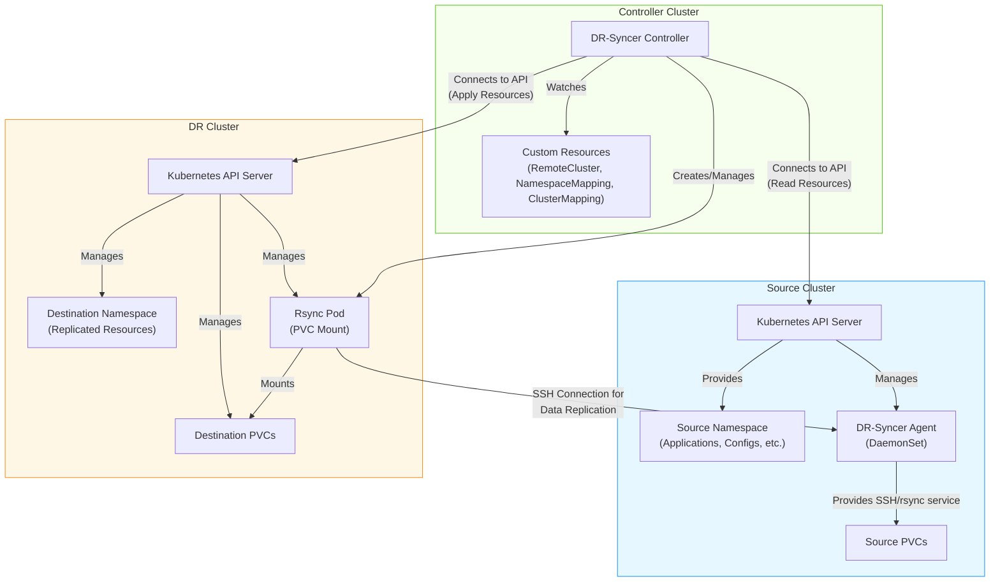
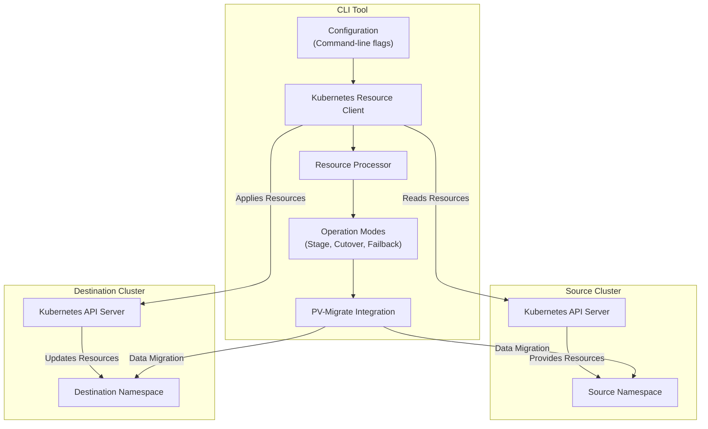
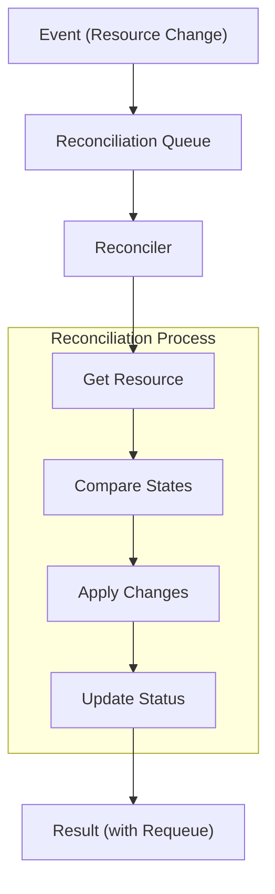
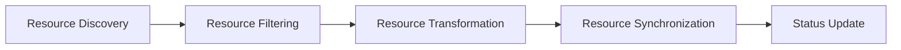
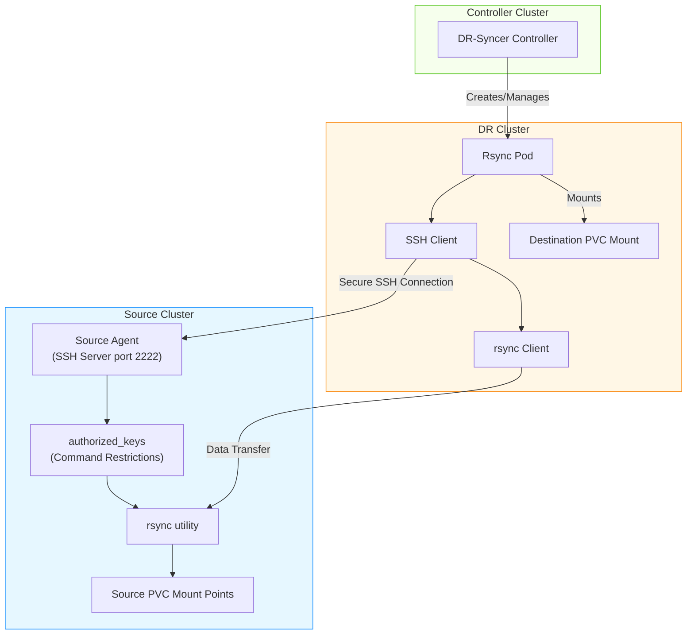
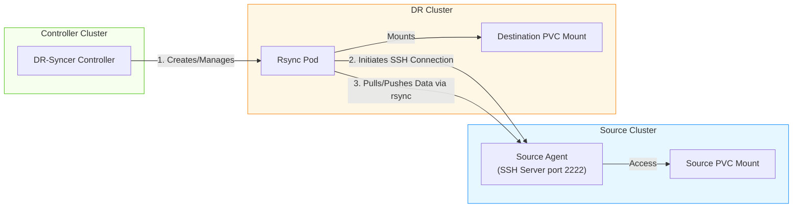
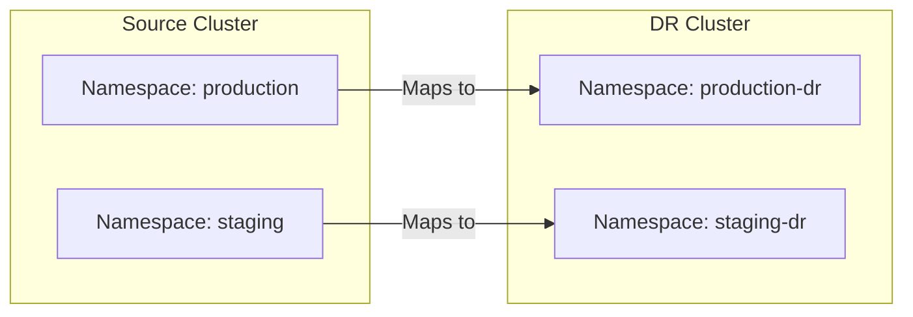

# Architecture Overview

DR-Syncer offers two distinct tools for disaster recovery synchronization:

1. **Controller**: A Kubernetes operator that runs continuously in your clusters
2. **CLI**: A standalone command-line tool for direct disaster recovery operations

Each tool serves different use cases but provides similar core functionality. This document outlines their architectures and key components.

## Controller System Architecture

DR-Syncer is built on the Kubernetes operator pattern, using custom controllers and custom resources to implement disaster recovery synchronization between clusters.



### Component Relationships

1. **Controller**: The core component running in a dedicated controller cluster
   - Manages the overall synchronization process
   - Watches custom resources for configuration changes
   - Connects to source and DR cluster APIs
   - Executes synchronization operations
   - Updates status and metrics

2. **Agents**: DaemonSets running in both source and destination clusters
   - Provides SSH and rsync services for PVC data replication
   - Runs on nodes where PVCs might be mounted
   - Provides direct PVC access without requiring root privileges
   - Communicates securely with rsync pods

3. **Custom Resources**:
   - `RemoteCluster`: Defines connection details for remote clusters
   - `NamespaceMapping`: Defines what and how to synchronize between namespaces
   - `ClusterMapping`: Defines the relationship between clusters for multiple namespace mappings

4. **Rsync Pod**: Temporary pod created in the DR cluster
   - Mounts destination PVCs
   - Initiates SSH connections to source agent
   - Executes rsync commands to transfer data
   - Reports completion back to controller

## CLI Architecture

The CLI tool provides a direct interface for disaster recovery operations without requiring the deployment of a controller or custom resources.



### CLI Components

1. **Command-line Interface**: Processes user inputs and flags
   - Validates configuration
   - Sets up clients and operation modes
   - Handles logging and output

2. **Resource Client**: Interfaces with Kubernetes APIs
   - Connects to source and destination clusters
   - Lists, gets, creates, and updates resources
   - Handles API versioning and conversion

3. **Resource Processor**: Transforms resources during synchronization
   - Filters resources based on type and labels
   - Modifies resources for destination environment
   - Handles namespace references and immutable fields

4. **Operation Modes**: Implements the three primary modes
   - Stage: Prepares DR environment without activation
   - Cutover: Activates DR environment by scaling
   - Failback: Returns to source environment

5. **PV-Migrate Integration**: Handles persistent data migration
   - Uses pv-migrate for efficient PVC data copying
   - Supports bi-directional data transfer
   - Configurable migration parameters

### CLI Operation Flow

1. **Initialization**:
   - Process command-line flags
   - Connect to source and destination clusters
   - Validate configuration

2. **Resource Discovery**:
   - Identify resources in source namespace
   - Apply type and label filters
   - Build dependency order

3. **Resource Processing**:
   - Transform resources for destination
   - Set scaling parameters based on mode
   - Preserve original configurations

4. **Execution**:
   - Apply resources to destination
   - Scale deployments according to mode
   - Trigger PVC data migration if enabled

5. **Completion**:
   - Validate results
   - Report success/failure
   - Exit with appropriate status code

## Controller Design

### Manager Pattern

The controller manager acts as the entry point that:
- Handles controller lifecycle
- Manages shared dependencies like clients and scheme
- Coordinates reconcilers
- Implements leader election for high availability
- Exposes metrics and health endpoints

```go
// Simplified controller manager setup
func main() {
    // Create manager
    mgr, err := ctrl.NewManager(ctrl.GetConfigOrDie(), ctrl.Options{
        Scheme:                 scheme,
        MetricsBindAddress:     metricsAddr,
        HealthProbeBindAddress: probeAddr,
        LeaderElection:         enableLeaderElection,
    })
    
    // Add reconcilers to manager
    if err = (&controllers.RemoteClusterReconciler{
        Client: mgr.GetClient(),
        Scheme: mgr.GetScheme(),
    }).SetupWithManager(mgr); err != nil {
        setupLog.Error(err, "unable to create controller", "controller", "RemoteCluster")
        os.Exit(1)
    }
    
    // Start manager
    if err := mgr.Start(ctrl.SetupSignalHandler()); err != nil {
        setupLog.Error(err, "problem running manager")
        os.Exit(1)
    }
}
```

### Reconciliation Pattern

DR-Syncer follows the reconciliation pattern, where controllers:
1. Observe the current state
2. Compare with desired state
3. Make changes to reach the desired state
4. Update status



### Resource Processing Flow

When synchronizing resources, DR-Syncer follows this high-level process:

1. **Discovery**: Identify resources to synchronize based on Replication configuration
2. **Filtering**: Apply type and label-based filters to select specific resources
3. **Transformation**: Modify resources as needed (e.g., scale deployments to zero)
4. **Synchronization**: Apply resources to the destination cluster
5. **Status Update**: Record results and metrics



## Controller PVC Sync Architecture

One of DR-Syncer's key features is its ability to replicate data from Persistent Volume Claims (PVCs) between clusters, which traditional Kubernetes replication doesn't handle.

### Agent Architecture



### Data Flow Pattern



The PVC synchronization uses this flow:

1. Controller identifies PVCs to synchronize in source cluster
2. Controller ensures PVCs exist in destination cluster with correct attributes
3. Controller creates an rsync pod in the DR cluster that mounts the destination PVC
4. Rsync pod initiates an SSH connection to the agent in the source cluster
5. Rsync pod transfers data between source and destination PVCs using rsync over SSH
6. Status is updated with synchronization results

### Security Model

DR-Syncer employs a robust security model for PVC data synchronization:

1. **SSH Key Management**:
   - Secure key generation with proper permissions
   - Keys stored as Kubernetes secrets
   - Automated key rotation capabilities
   - Single-layer authentication system

2. **Direct Access Pattern**:
   - Agent runs with minimal privileges
   - Direct access to mounted PVCs
   - No root filesystem access required
   - Clean separation of concerns

3. **Command Restriction**:
   - Direct command restriction via authorized_keys template
   - SSH authorized_keys restricts allowed commands
   - Only specific rsync operations permitted
   - No shell access
   - Elimination of intermediate script processing
   - Simplified security model with OpenSSH built-in features
   - Comprehensive logging of operations

## Namespace Mapping

DR-Syncer supports flexible namespace mapping between source and destination clusters:



This mapping ensures:
- Resource references are updated to use the destination namespace
- Namespace-specific configurations are preserved
- Cross-namespace dependencies are handled properly

## Health Monitoring

DR-Syncer implements comprehensive health monitoring:

1. **Readiness Probes**:
   - Controller readiness endpoints
   - Agent health checks
   - Connection verification

2. **Metrics Exposure**:
   - Prometheus metrics
   - Synchronization statistics
   - Performance tracking
   - Error counts

3. **Status Conditions**:
   - Phase tracking (Pending, Running, Completed, Failed)
   - Per-resource status tracking
   - Detailed error reporting
   - Sync statistics

## Error Handling

DR-Syncer employs robust error handling mechanisms:

1. **Retry Mechanisms**:
   - Exponential backoff with jitter
   - Configurable retry limits
   - Status reporting for failures

2. **Failure Recovery**:
   - Graceful failure handling
   - Partial synchronization recovery
   - Resource conflict resolution
   - Transaction-like operations where possible

3. **Event Recording**:
   - Kubernetes events for important operations
   - Status condition updates
   - Detailed logging
   - Diagnostic information

## Code Organization

DR-Syncer organizes its code following standard Go project structure and controller-runtime patterns:

```
├── api/
│   └── v1alpha1/          # CRD type definitions
├── controllers/
│   ├── remotecluster/     # RemoteCluster controller
│   └── replication/       # Replication controller
├── pkg/
│   ├── config/            # Configuration management
│   ├── agent/             # Agent implementation
│   └── logging/           # Logging setup and adapters
└── charts/
    └── dr-syncer/
        └── crds/          # Generated CRDs
```

This organization provides:
- Clean separation of concerns
- Reusable packages
- Test-friendly structure
- Consistent patterns across controllers
